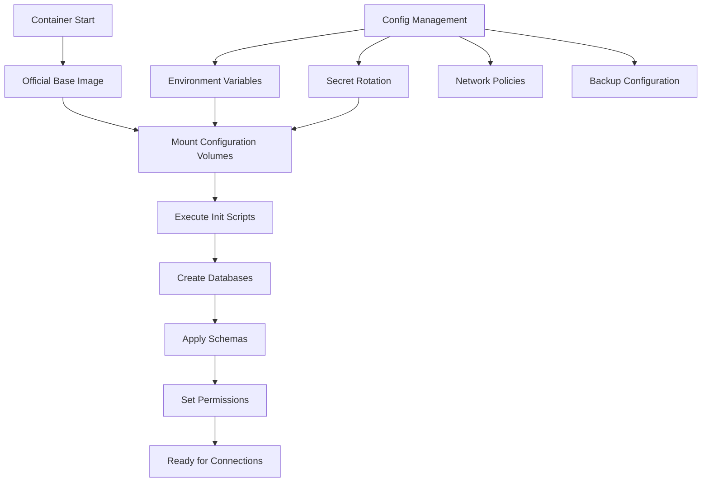

# ADR-015: Database Deployment Strategy

## Status

Accepted

## Context

The NexaNest platform requires a robust database deployment strategy that balances several concerns:

1. **Security**: Need to use up-to-date, patched database images
2. **Flexibility**: Support different configurations across environments (dev, staging, prod)
3. **Maintainability**: Easy version upgrades and configuration changes
4. **Compliance**: Meet SOC 2 Type II requirements for data handling
5. **Performance**: Optimize for both development and production workloads
6. **Microservices**: Each service needs isolated database schemas

Two primary approaches were considered:
1. Deploy clean Docker images and use configuration management tools (Ansible/Terraform)
2. Build custom Docker images with pre-configured databases and schemas

## Decision

We will use a **hybrid approach** that combines the benefits of both strategies:

### Layered Architecture

1. **Base Layer**: Use official Docker images
   - PostgreSQL: `postgres:15`
   - TimescaleDB: `timescale/timescaledb:latest-pg15`
   - Redis: `redis:7-alpine`

2. **Configuration Layer**: Docker entrypoint scripts and volume mounts
   - Database initialization scripts in `/docker-entrypoint-initdb.d/`
   - Schema files mounted as volumes
   - Configuration files (postgres.conf, redis.conf)

3. **Orchestration Layer**: External configuration management
   - Ansible/Terraform for environment-specific settings
   - Secret management via Docker Secrets or external vaults
   - Network policies and security groups
   - Backup and recovery procedures

### Implementation Details

```yaml
# Docker Compose structure for deployment to pgdb.nn.local
services:
  postgres:
    image: postgres:15  # Official image - always latest patches
    volumes:
      - ./init:/docker-entrypoint-initdb.d:ro     # Init scripts
      - ./schemas:/schemas:ro                      # Schema definitions
      - ./config/postgres.conf:/etc/postgresql/postgresql.conf:ro
    environment:
      POSTGRES_PASSWORD_FILE: /run/secrets/db_password  # Secret management
```

### NexaNest Specific Implementation

For NexaNest, databases are deployed to a dedicated Docker host: **pgdb.nn.local**

```bash
# Deploy databases to remote host
docker -H ssh://pgdb.nn.local compose -f docker-compose.db-remote.yml up -d

# Application services connect to remote databases
DB_HOST=pgdb.nn.local
POSTGRES_HOST=${DB_HOST}  # pgdb.nn.local:5432
TIMESCALE_HOST=${DB_HOST}  # pgdb.nn.local:5433
REDIS_HOST=${DB_HOST}      # pgdb.nn.local:6379
```

### Database Initialization Flow



### Directory Structure

```
infrastructure/
├── database/
│   ├── init/                    # Initialization scripts
│   │   ├── 01-create-databases.sql
│   │   ├── 02-apply-schemas.sql
│   │   └── 03-set-permissions.sql
│   ├── schemas/                 # Service-specific schemas
│   │   ├── auth/
│   │   ├── portfolio/
│   │   └── analytics/
│   ├── config/                  # Database configurations
│   │   ├── postgres.conf
│   │   ├── redis.conf
│   │   └── timescale.conf
│   └── migrations/              # Schema migration scripts
│       ├── auth/
│       ├── portfolio/
│       └── analytics/
```

## Rationale

### Why Not Custom Database Images?

1. **Security Vulnerabilities**: Custom images become outdated quickly
2. **Maintenance Burden**: Need to rebuild images for every PostgreSQL update
3. **Size**: Images with data are significantly larger
4. **Separation of Concerns**: Mixing infrastructure and application concerns
5. **CI/CD Complexity**: Longer build times and registry storage

### Benefits of Hybrid Approach

1. **Security**: Always use latest official images with security patches
2. **Flexibility**: Environment-specific configurations without rebuilding
3. **GitOps**: All configurations in version control
4. **Microservices**: Each service owns its schema and migrations
5. **Development**: Fast local setup with consistent configuration
6. **Production**: Secure secret management and audit trails

## Consequences

### Positive

- **Security**: Automated security updates via base image updates
- **Flexibility**: Easy to adjust configurations per environment
- **Maintainability**: Clear separation between infrastructure and data
- **Compliance**: Audit trail for all configuration changes
- **Performance**: Optimized configurations per environment
- **Portability**: Works across different orchestration platforms

### Negative

- **Complexity**: Requires understanding of both Docker and config management
- **Initial Setup**: More moving parts during first deployment
- **Documentation**: Need comprehensive runbooks for operations

### Mitigation Strategies

1. **Automation**: Scripts to simplify deployment process
2. **Documentation**: Detailed runbooks and troubleshooting guides
3. **Templates**: Reusable configuration templates
4. **Monitoring**: Comprehensive database monitoring and alerting

## Implementation Plan

### Phase 1: Development Environment (Current) - ✅ COMPLETED
- ✅ Databases deployed to pgdb.nn.local via docker-compose.db-remote.yml
- ✅ Application services connect to remote databases via .env.db configuration
- ✅ Automated initialization scripts and schema management
- ✅ Local secret management via .env files
- ✅ SSH key-based authentication with sudo Docker access
- ✅ PostgreSQL, TimescaleDB, and Redis containers running and healthy
- ✅ Database initialization with auth and portfolio schemas

### Phase 2: Staging Environment
- Docker Swarm deployment with remote database host
- External secret management via Docker Secrets
- Automated backups and monitoring
- SSL/TLS encryption for database connections

### Phase 3: Production Environment
- Kubernetes deployment (future) with external database tier
- Vault integration for secrets management
- Multi-region replication and disaster recovery
- Automated failover and high availability

## Security Considerations

1. **Secret Management**:
   ```yaml
   # Development: Environment variables
   POSTGRES_PASSWORD=${POSTGRES_PASSWORD:-dev_password}
   
   # Production: Docker secrets or Vault
   POSTGRES_PASSWORD_FILE=/run/secrets/postgres_password
   ```

2. **Network Isolation**:
   - Separate networks for database tier
   - No direct internet access
   - Service-specific access controls

3. **Encryption**:
   - TLS for all connections
   - Encrypted storage volumes
   - Encrypted backups

## Monitoring and Maintenance

1. **Health Checks**:
   ```yaml
   healthcheck:
     test: ["CMD-SHELL", "pg_isready -U nexanest"]
     interval: 30s
     timeout: 10s
     retries: 5
   ```

2. **Backup Strategy**:
   - Automated daily backups
   - Point-in-time recovery
   - Cross-region replication

3. **Update Process**:
   - Test updates in staging
   - Rolling updates with zero downtime
   - Automated rollback capabilities

## Related Decisions

- ADR-001: Microservices Architecture
- ADR-003: Docker Swarm for POC
- ADR-008: PostgreSQL Outside Swarm
- ADR-013: Configurable Instrumentation

## References

- [PostgreSQL Docker Official Image](https://hub.docker.com/_/postgres)
- [Docker Best Practices for Databases](https://docs.docker.com/develop/dev-best-practices/)
- [Twelve-Factor App - Config](https://12factor.net/config)
- [OWASP Docker Security](https://cheatsheetseries.owasp.org/cheatsheets/Docker_Security_Cheat_Sheet.html)