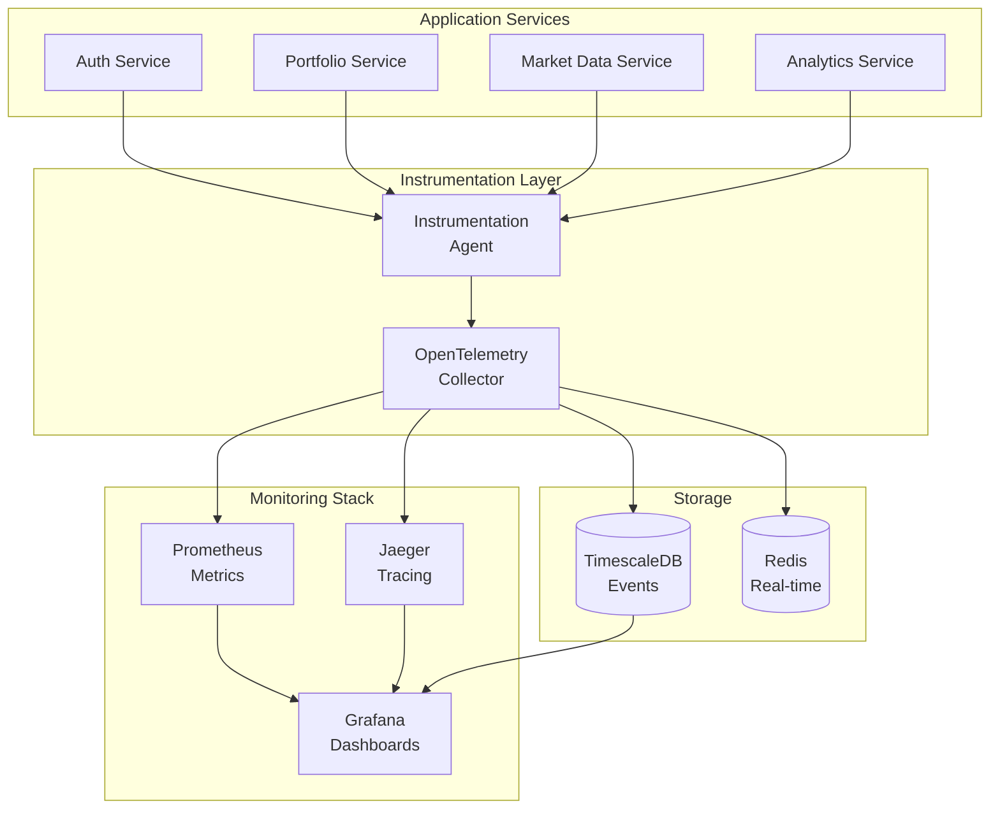
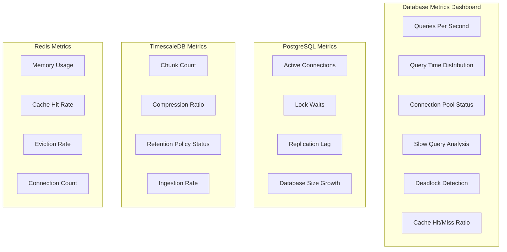

# Architecture Decision Records (ADRs)

This page consolidates all Architecture Decision Records for the NexaNest project.

## ADR-001: Microservices over Monolith

**Status**: Accepted\
**Date**: 2025-05-31\
**Decision**: Use microservices architecture\
**Rationale**: Better scalability, technology flexibility, team autonomy

## ADR-002: Python for AI Services, Go for Performance-Critical Services

**Status**: Accepted\
**Date**: 2025-05-31\
**Decision**: Use Python for AI/ML services, Go for high-performance services\
**Rationale**: Python has better AI/ML ecosystem, Go provides better performance

## ADR-003: Docker Swarm for Container Orchestration (POC Phase)

**Status**: Accepted\
**Date**: 2025-05-31\
**Decision**: Use Docker Swarm for POC deployment instead of Kubernetes\
**Rationale**: Existing operational Docker Swarm cluster, simpler for POC phase

## ADR-004: Event-Driven Architecture for Service Communication

**Status**: Accepted\
**Date**: 2025-05-31\
**Decision**: Use Kafka for event streaming\
**Rationale**: Decoupling, scalability, audit trail

## ADR-005: UV for Python Package Management

**Status**: Accepted\
**Date**: 2025-05-31\
**Decision**: Use uv for all Python dependency management\
**Rationale**: Faster, more reliable than pip, better dependency resolution

## ADR-006: Defer AWS-Specific Services

**Status**: Accepted\
**Date**: 2025-05-31\
**Decision**: Move AWS-specific implementations to future development\
**Rationale**: Focus on cloud-agnostic POC first

## ADR-007: Project as Proof of Concept (POC)

**Status**: Accepted\
**Date**: 2025-05-31\
**Decision**: Consider initial implementation as POC\
**Rationale**: Validate architecture and features before production build

## ADR-008: PostgreSQL Outside Swarm

**Status**: Accepted\
**Date**: 2025-05-31\
**Decision**: Deploy PostgreSQL container on Swarm node but outside Swarm orchestration\
**Rationale**: Database persistence and management considerations

## ADR-009: Local Docker Registry

**Status**: Accepted\
**Date**: 2025-05-31\
**Decision**: Use local Docker registry for image storage\
**Rationale**: Better control, no external dependencies for POC

## ADR-010: MkDocs for Documentation

**Status**: Accepted\
**Date**: 2025-05-31\
**Decision**: Use MkDocs with Material theme and Mermaid diagrams\
**Rationale**: Professional appearance, easy maintenance, good diagram support

## ADR-011: Documentation Standards

**Status**: Accepted\
**Date**: 2025-05-31\
**Decision**: All documentation must include frontmatter and be linted\
**Rationale**: Consistency, quality, and metadata management

## ADR-012: Australia/Adelaide Timezone for All Timestamps

**Status**: Accepted\
**Date**: 2025-05-31\
**Decision**: Use Australia/Adelaide timezone for all timestamps throughout the system\
**Rationale**: Consistent timezone handling, aligns with primary user base location

### Context

The system needs a consistent approach to handling timestamps across all services, databases, and user
interfaces. Different timezone approaches can lead to confusion and errors in time-sensitive operations
like trading hours, reporting, and audit trails.

### Decision

All timestamps in the NexaNest system will use Australia/Adelaide timezone (ACST/ACDT):
- Database storage: Store timestamps with timezone information
- API responses: Return timestamps in Australia/Adelaide timezone
- Log files: Use Australia/Adelaide timezone for all logging
- Scheduled jobs: Schedule based on Australia/Adelaide timezone
- User interface: Display times in Australia/Adelaide timezone by default

### Consequences

**Positive:**
- Consistency across all system components
- Simplified debugging and troubleshooting
- Clear audit trails for compliance
- Reduced timezone conversion errors
- Better alignment with Australian market hours

**Negative:**
- International users may need to mentally convert times
- Future expansion to other regions may require refactoring
- Daylight saving transitions need careful handling

### Implementation Notes

- Use `TZ=Australia/Adelaide` environment variable in all services
- Configure databases to use `Australia/Adelaide` as default timezone
- Use timezone-aware datetime objects in Python (`pytz` or `zoneinfo`)
- Document timezone assumptions in API specifications
- Include timezone information in all timestamp fields

## ADR-013: Configurable Application Instrumentation

**Status**: Accepted  
**Date**: 2025-05-31  
**Decision**: Implement configurable instrumentation throughout the application with adjustable granularity levels  
**Rationale**: Enable comprehensive monitoring, debugging, and performance analysis while maintaining flexibility to control overhead and data volume in different environments

### Context

Modern applications require detailed instrumentation for:
- Performance monitoring and optimization
- Debugging production issues
- Security audit trails
- Business analytics and insights
- Compliance requirements (SOC 2, financial regulations)
- Real-time alerting and anomaly detection

However, excessive instrumentation can:
- Impact application performance
- Generate overwhelming data volumes
- Increase storage and processing costs
- Create privacy and security concerns

### Decision Details

Implement a multi-level instrumentation system with the following capabilities:

#### Instrumentation Levels

1. **CRITICAL** (Level 1): Essential system events only
   - Service startup/shutdown
   - Critical errors and exceptions
   - Security events (authentication failures, unauthorized access)
   - Data corruption or integrity issues

2. **ERROR** (Level 2): Error tracking and recovery
   - All CRITICAL events
   - Application errors and exceptions
   - Failed external API calls
   - Database connection failures
   - Circuit breaker activations

3. **WARN** (Level 3): Warnings and performance issues
   - All ERROR level events
   - Performance threshold breaches
   - Resource exhaustion warnings
   - Deprecated API usage
   - Configuration issues

4. **INFO** (Level 4): Standard operational events
   - All WARN level events
   - Business logic events (trades, deposits, withdrawals)
   - User actions (login, portfolio creation, settings changes)
   - Scheduled job execution
   - Cache hits/misses

5. **DEBUG** (Level 5): Detailed debugging information
   - All INFO level events
   - Database queries and execution times
   - External API request/response details
   - Detailed function entry/exit
   - Variable state changes

6. **TRACE** (Level 6): Comprehensive tracing
   - All DEBUG level events
   - Complete request/response payloads
   - Detailed call stacks
   - Memory allocation patterns
   - Network packet-level information

#### Configuration Options

```yaml
instrumentation:
  enabled: true
  level: INFO  # CRITICAL, ERROR, WARN, INFO, DEBUG, TRACE
  
  # Component-specific overrides
  components:
    auth_service:
      level: DEBUG
      include_request_bodies: false
    portfolio_service:
      level: INFO
      trace_database_queries: true
    market_data_service:
      level: WARN  # High-frequency, reduce noise
      sample_rate: 0.1  # Sample 10% of events
    
  # Feature flags
  features:
    trace_external_apis: true
    include_stack_traces: true
    mask_sensitive_data: true
    real_time_metrics: true
    
  # Database instrumentation
  database:
    enabled: true
    trace_queries: true
    trace_connections: true
    include_query_plans: false  # DEBUG level only
    mask_sensitive_columns: ['password_hash', 'api_key', 'token']
    slow_query_threshold: 100ms
    connection_pool_metrics: true
    deadlock_detection: true
    
  # Sampling and throttling
  sampling:
    default_rate: 1.0  # 100% sampling
    high_frequency_rate: 0.01  # 1% for high-frequency events
    error_boost: 5.0  # Always capture errors with 5x boost
    
  # Output destinations
  outputs:
    - type: structured_logs
      format: json
      destination: stdout
    - type: metrics
      destination: prometheus
    - type: traces
      destination: jaeger
    - type: events
      destination: timescaledb
```

#### Implementation Stack

**Core Technologies:**
- **OpenTelemetry**: Industry-standard instrumentation framework
- **Prometheus**: Metrics collection and alerting
- **Jaeger**: Distributed tracing
- **Grafana**: Visualization and dashboards
- **TimescaleDB**: Event storage and analytics

**Python Implementation:**
```python
# Core instrumentation decorator
@instrument(
    level=InstrumentationLevel.INFO,
    include_args=True,
    include_result=False,
    mask_fields=['password', 'token', 'api_key']
)
def create_portfolio(user_id: str, portfolio_data: dict):
    # Function implementation
    pass

# Context manager for detailed tracing
with tracer.start_as_current_span("portfolio_calculation") as span:
    span.set_attribute("portfolio.id", portfolio_id)
    span.set_attribute("calculation.type", "market_value")
    # Calculation logic

# Database instrumentation with SQLAlchemy
from sqlalchemy import event
from sqlalchemy.engine import Engine

@event.listens_for(Engine, "before_cursor_execute")
def receive_before_cursor_execute(conn, cursor, statement, parameters, context, executemany):
    context._query_start_time = time.time()
    tracer.start_span("db.query", attributes={
        "db.statement": statement,
        "db.operation": statement.split()[0].upper(),
        "db.connection_string": str(conn.engine.url).replace(conn.engine.url.password, "***")
    })

@event.listens_for(Engine, "after_cursor_execute")
def receive_after_cursor_execute(conn, cursor, statement, parameters, context, executemany):
    total = time.time() - context._query_start_time
    current_span = tracer.current_span()
    if current_span:
        current_span.set_attribute("db.duration", total)
        current_span.set_attribute("db.rows_affected", cursor.rowcount)
        current_span.finish()
```

#### Architecture Integration



### Database Instrumentation Details

Database activity represents a critical component of application performance and security. Our instrumentation captures comprehensive database metrics across all layers:

#### Database Metrics Captured

**Query Performance:**
- Query execution time and duration
- Query complexity analysis
- Slow query detection and alerting
- Query plan analysis (DEBUG level)
- Parameter binding performance
- Result set size and processing time

**Connection Management:**
- Connection pool utilization
- Connection acquisition/release times
- Connection timeout events
- Pool exhaustion warnings
- Connection leak detection
- Idle connection cleanup

**Database Health:**
- Deadlock detection and resolution
- Lock wait times and contention
- Transaction isolation level impacts
- Rollback frequency and causes
- Database error rates by type
- Resource utilization (CPU, memory, I/O)

#### Implementation by Database Type

**PostgreSQL Instrumentation:**
```python
# PostgreSQL-specific instrumentation
import psycopg2.extensions
from psycopg2 import sql

class PostgreSQLInstrumentation:
    @staticmethod
    def instrument_connection(conn):
        # Enable query logging
        conn.set_session(readonly=False, autocommit=False)
        
        # Track connection metrics
        with tracer.start_span("db.connection") as span:
            span.set_attribute("db.system", "postgresql")
            span.set_attribute("db.name", conn.info.dbname)
            span.set_attribute("db.user", conn.info.user)
            span.set_attribute("db.host", conn.info.host)
            span.set_attribute("db.port", conn.info.port)

    @staticmethod
    def log_slow_query(query, duration, threshold=0.1):
        if duration > threshold:
            logger.warning("Slow query detected", extra={
                "query": query,
                "duration_ms": duration * 1000,
                "threshold_ms": threshold * 1000,
                "service": "database"
            })
```

**TimescaleDB Instrumentation:**
```python
# TimescaleDB-specific metrics
class TimescaleDBInstrumentation:
    @staticmethod
    def track_hypertable_metrics(table_name):
        with tracer.start_span("timescale.hypertable_stats") as span:
            span.set_attribute("timescale.table", table_name)
            
            # Query chunk information
            chunk_query = """
            SELECT count(*) as chunk_count,
                   pg_size_pretty(sum(chunk_size)) as total_size
            FROM timescaledb_information.chunks 
            WHERE hypertable_name = %s
            """
            # Execute and log metrics

    @staticmethod
    def monitor_compression():
        with tracer.start_span("timescale.compression") as span:
            compression_query = """
            SELECT hypertable_name,
                   compression_enabled,
                   sum(uncompressed_heap_size) as uncompressed_size,
                   sum(compressed_heap_size) as compressed_size
            FROM timescaledb_information.chunks
            GROUP BY hypertable_name, compression_enabled
            """
            # Track compression ratios and efficiency
```

**Redis Instrumentation:**
```python
# Redis command tracking
import redis
from redis.connection import Connection

class RedisInstrumentation:
    @staticmethod
    def instrument_command(pipe, command, *args):
        with tracer.start_span("redis.command") as span:
            span.set_attribute("redis.command", command)
            span.set_attribute("redis.key", args[0] if args else "")
            span.set_attribute("redis.database", pipe.connection_pool.connection_kwargs.get('db', 0))
            
            start_time = time.time()
            result = pipe.execute_command(command, *args)
            duration = time.time() - start_time
            
            span.set_attribute("redis.duration", duration)
            span.set_attribute("redis.result_size", len(str(result)) if result else 0)
            
            return result
```

#### Database Security Instrumentation

**Data Access Monitoring:**
```sql
-- PostgreSQL: Log all data access
CREATE OR REPLACE FUNCTION log_data_access()
RETURNS event_trigger AS $$
BEGIN
    INSERT INTO events.data_access_log (
        timestamp,
        user_name,
        database_name,
        schema_name,
        table_name,
        operation,
        session_id,
        client_ip
    ) VALUES (
        NOW(),
        current_user,
        current_database(),
        TG_SCHEMA_NAME,
        TG_TABLE_NAME,
        TG_OP,
        pg_backend_pid(),
        inet_client_addr()
    );
END;
$$ LANGUAGE plpgsql;

-- Trigger for sensitive tables
CREATE EVENT TRIGGER data_access_audit 
ON ddl_command_end 
EXECUTE FUNCTION log_data_access();
```

**Row-Level Security Monitoring:**
```python
# Track RLS policy applications
class RLSInstrumentation:
    @staticmethod
    def monitor_rls_application(query, user_id, table):
        with tracer.start_span("db.rls_check") as span:
            span.set_attribute("db.table", table)
            span.set_attribute("user.id", user_id)
            span.set_attribute("security.policy", "row_level_security")
            
            # Check if RLS is enabled
            rls_query = """
            SELECT relrowsecurity, relforcerowsecurity 
            FROM pg_class 
            WHERE relname = %s
            """
            # Log RLS enforcement status
```

#### Performance Monitoring Integration

**Database Dashboard Metrics:**


**Alerting Rules:**
```yaml
# Prometheus alerting rules for database metrics
groups:
  - name: database_alerts
    rules:
      - alert: SlowQueryDetected
        expr: db_query_duration_seconds > 1.0
        for: 5m
        labels:
          severity: warning
        annotations:
          summary: "Slow database query detected"
          description: "Query taking longer than 1 second"
      
      - alert: DatabaseConnectionPoolExhausted
        expr: db_connection_pool_active / db_connection_pool_max > 0.9
        for: 2m
        labels:
          severity: critical
        annotations:
          summary: "Database connection pool nearly exhausted"
          description: "{{ $value }}% of connections in use"
      
      - alert: DeadlockDetected
        expr: increase(db_deadlocks_total[5m]) > 0
        labels:
          severity: warning
        annotations:
          summary: "Database deadlock detected"
          description: "{{ $value }} deadlocks in the last 5 minutes"
```

### Benefits

**Development:**
- Faster debugging with detailed traces
- Performance bottleneck identification
- Code path analysis and optimization

**Operations:**
- Real-time system health monitoring
- Proactive alerting on issues
- Capacity planning insights
- Root cause analysis

**Business:**
- User behavior analytics
- Feature usage metrics
- Performance impact on business metrics
- Compliance audit trails

**Security:**
- Comprehensive audit logging
- Attack pattern detection
- Access control monitoring
- Data flow tracking

### Risks and Mitigations

**Performance Impact:**
- Risk: Instrumentation overhead affects application performance
- Mitigation: Configurable sampling rates, async processing, level-based filtering

**Data Volume:**
- Risk: Excessive log/metric data overwhelming storage
- Mitigation: Retention policies, compression, intelligent sampling

**Sensitive Data Exposure:**
- Risk: Logs contain sensitive user or financial data
- Mitigation: Automatic data masking, field-level configuration, encryption

**Complexity:**
- Risk: Over-instrumentation makes debugging harder
- Mitigation: Hierarchical levels, component-specific configuration, good defaults

### Implementation Plan

**Phase 1: Foundation (Weeks 1-2)**
- Set up OpenTelemetry infrastructure
- Implement basic instrumentation decorators
- Configure Prometheus and Grafana
- Define instrumentation levels and standards

**Phase 2: Core Services (Weeks 3-4)**
- Instrument Auth and Portfolio services
- Implement structured logging
- Set up basic dashboards and alerts
- Add database query tracing

**Phase 3: Advanced Features (Weeks 5-6)**
- Distributed tracing across services
- Real-time metrics and alerting
- Custom business metrics
- Performance profiling integration

**Phase 4: Optimization (Weeks 7-8)**
- Fine-tune sampling rates
- Optimize storage and retention
- Advanced analytics and reporting
- Documentation and training

### Configuration Examples

**Development Environment:**
```yaml
instrumentation:
  level: DEBUG
  features:
    trace_external_apis: true
    include_stack_traces: true
  sampling:
    default_rate: 1.0
```

**Production Environment:**
```yaml
instrumentation:
  level: INFO
  features:
    trace_external_apis: true
    include_stack_traces: false
    mask_sensitive_data: true
  sampling:
    default_rate: 0.1
    error_boost: 10.0
```

**High-Performance Environment:**
```yaml
instrumentation:
  level: WARN
  features:
    real_time_metrics: false
  sampling:
    default_rate: 0.01
    high_frequency_rate: 0.001
```

## ADR-014: Mandatory Frontmatter for All Documentation

**Status**: Accepted  
**Date**: 2025-11-06  
**Decision**: All documentation files must include YAML frontmatter with required metadata fields  
**Rationale**: Ensure consistent metadata management, enable automated processing, and improve content discoverability

## ADR-015: Database Deployment Strategy

**Status**: Accepted  
**Date**: 2025-06-20  
**Decision**: Use hybrid approach with official Docker images and configuration management  
**Rationale**: Balances security, flexibility, and maintainability for database deployments

### Context

Documentation quality and consistency are critical for project maintainability and team collaboration. Currently, documentation files lack standardized metadata, making it difficult to:

- Track content ownership and maintenance responsibility
- Implement automated content validation and processing
- Generate dynamic indexes and navigation
- Ensure content freshness and accuracy
- Enable content management workflows
- Support compliance and audit requirements

### Decision

All documentation files (`.md`, `.mdx`) in the NexaNest project must include YAML frontmatter with the following structure:

#### Required Fields

```yaml
---
title: "Document Title"
description: "Brief description of the document content"
authors:
  - "Author Name"
  - "Co-Author Name"
datetime: "YYYY-MM-DD HH:MM:SS"
status: "draft|review|approved|deprecated"
tags:
  - "tag1"
  - "tag2"
---
```

#### Optional Fields

```yaml
---
# ... required fields above ...

# Content management
version: "1.2.0"
last_updated: "YYYY-MM-DD HH:MM:SS"
review_date: "YYYY-MM-DD"
expiry_date: "YYYY-MM-DD"

# Content classification
category: "architecture|development|operations|business"
audience: "developer|operator|manager|all"
complexity: "beginner|intermediate|advanced"
estimated_reading_time: "5 min"

# Relationships
related_docs:
  - "path/to/related/doc.md"
  - "another/related/doc.md"
supersedes:
  - "path/to/old/doc.md"
dependencies:
  - "required/prerequisite/doc.md"

# External references
external_links:
  - url: "https://example.com/reference"
    title: "External Reference"
    type: "specification|documentation|tool"

# Technical metadata
technology_stack:
  - "Python"
  - "FastAPI"
  - "PostgreSQL"
platforms:
  - "Linux"
  - "Docker"
minimum_version_requirements:
  python: "3.11+"
  docker: "20.10+"

# Business metadata
business_value: "high|medium|low"
compliance_requirements:
  - "SOC2"
  - "PCI-DSS"
security_classification: "public|internal|confidential|restricted"

# Automation
auto_generated: false
source_file: "path/to/source/file"
template_version: "1.0"
---
```

#### Document Type Examples

**Architecture Documentation:**
```yaml
---
title: "Microservices Architecture Overview"
description: "High-level architecture design for NexaNest microservices"
authors:
  - "Architecture Team"
datetime: "2025-11-06 10:00:00"
status: "approved"
tags:
  - "architecture"
  - "microservices"
  - "design"
category: "architecture"
audience: "developer"
complexity: "intermediate"
technology_stack:
  - "Docker"
  - "Kubernetes"
  - "FastAPI"
business_value: "high"
---
```

**API Documentation:**
```yaml
---
title: "Portfolio Service API Reference"
description: "REST API endpoints for portfolio management operations"
authors:
  - "Backend Team"
datetime: "2025-11-06 10:00:00"
status: "approved"
tags:
  - "api"
  - "portfolio"
  - "reference"
category: "development"
audience: "developer"
complexity: "intermediate"
version: "v2.1.0"
technology_stack:
  - "FastAPI"
  - "PostgreSQL"
  - "OpenAPI"
external_links:
  - url: "https://swagger.io/specification/"
    title: "OpenAPI Specification"
    type: "specification"
---
```

**Operational Procedures:**
```yaml
---
title: "Database Backup and Recovery Procedures"
description: "Step-by-step procedures for database maintenance operations"
authors:
  - "DevOps Team"
datetime: "2025-11-06 10:00:00"
status: "approved"
tags:
  - "database"
  - "backup"
  - "procedures"
  - "operations"
category: "operations"
audience: "operator"
complexity: "intermediate"
review_date: "2025-12-06"
compliance_requirements:
  - "SOC2"
security_classification: "internal"
platforms:
  - "Linux"
  - "Docker"
minimum_version_requirements:
  postgresql: "13+"
  docker: "20.10+"
---
```

### Implementation Requirements

#### Validation Rules

1. **Required Field Validation:**
   - All required fields must be present
   - `title` must be non-empty string
   - `description` must be 10-200 characters
   - `authors` must contain at least one non-empty string
   - `datetime` must be valid ISO 8601 format in Australia/Adelaide timezone
   - `status` must be one of: draft, review, approved, deprecated
   - `tags` must contain at least one non-empty string

2. **Content Rules:**
   - Title should be concise and descriptive
   - Description should summarize document purpose
   - Authors should use real names or team identifiers
   - Datetime should reflect creation or last major update
   - Tags should be lowercase, hyphen-separated
   - Status should reflect current document state

3. **Consistency Rules:**
   - File naming should reflect document title
   - Tags should use standardized vocabulary
   - Technology stack entries should use canonical names
   - External links must be accessible and relevant

#### Automated Tooling

**Pre-commit Hook:**
```bash
#!/bin/bash
# .git/hooks/pre-commit

# Check frontmatter in all markdown files
find . -name "*.md" -o -name "*.mdx" | while read file; do
    if ! python scripts/validate-frontmatter.py "$file"; then
        echo "Error: Invalid frontmatter in $file"
        exit 1
    fi
done
```

**Validation Script:**
```python
# scripts/validate-frontmatter.py
import yaml
import sys
from datetime import datetime
from pathlib import Path

REQUIRED_FIELDS = ['title', 'description', 'authors', 'datetime', 'status', 'tags']
VALID_STATUSES = ['draft', 'review', 'approved', 'deprecated']

def validate_frontmatter(file_path):
    """Validate YAML frontmatter in markdown file."""
    content = Path(file_path).read_text()
    
    if not content.startswith('---\n'):
        return False, "Missing frontmatter delimiter"
    
    try:
        # Extract frontmatter
        parts = content.split('---\n', 2)
        if len(parts) < 3:
            return False, "Invalid frontmatter structure"
        
        frontmatter = yaml.safe_load(parts[1])
        
        # Validate required fields
        for field in REQUIRED_FIELDS:
            if field not in frontmatter:
                return False, f"Missing required field: {field}"
        
        # Validate field types and values
        if not isinstance(frontmatter['title'], str) or not frontmatter['title'].strip():
            return False, "Title must be non-empty string"
        
        if len(frontmatter['description']) < 10 or len(frontmatter['description']) > 200:
            return False, "Description must be 10-200 characters"
        
        if frontmatter['status'] not in VALID_STATUSES:
            return False, f"Status must be one of: {', '.join(VALID_STATUSES)}"
        
        # Validate datetime format
        try:
            datetime.fromisoformat(frontmatter['datetime'])
        except ValueError:
            return False, "Invalid datetime format (use YYYY-MM-DD HH:MM:SS)"
        
        return True, "Valid frontmatter"
        
    except yaml.YAMLError as e:
        return False, f"Invalid YAML: {e}"

if __name__ == "__main__":
    if len(sys.argv) != 2:
        print("Usage: python validate-frontmatter.py <file>")
        sys.exit(1)
    
    is_valid, message = validate_frontmatter(sys.argv[1])
    if not is_valid:
        print(f"Validation failed: {message}")
        sys.exit(1)
    
    print("Frontmatter validation passed")
```

**MkDocs Integration:**
```yaml
# mkdocs.yml
plugins:
  - search
  - meta-descriptions
  - git-revision-date-localized:
      type: datetime
      timezone: Australia/Adelaide
  - frontmatter-validator:
      required_fields:
        - title
        - description
        - authors
        - datetime
        - status
        - tags
```

#### Content Management Features

**Automated Index Generation:**
```python
# scripts/generate-doc-index.py
def generate_index():
    """Generate documentation index from frontmatter."""
    docs = []
    for md_file in Path('docs').rglob('*.md'):
        frontmatter = extract_frontmatter(md_file)
        docs.append({
            'path': str(md_file),
            'title': frontmatter['title'],
            'description': frontmatter['description'],
            'category': frontmatter.get('category', 'general'),
            'tags': frontmatter['tags'],
            'status': frontmatter['status'],
            'last_updated': frontmatter.get('last_updated', frontmatter['datetime'])
        })
    
    # Group by category and generate index
    index = generate_markdown_index(docs)
    Path('docs/index.md').write_text(index)
```

**Content Audit Reports:**
```python
# scripts/audit-documentation.py
def audit_documentation():
    """Generate content audit report."""
    issues = []
    
    for md_file in Path('docs').rglob('*.md'):
        frontmatter = extract_frontmatter(md_file)
        
        # Check for outdated content
        last_updated = datetime.fromisoformat(frontmatter.get('last_updated', frontmatter['datetime']))
        if (datetime.now() - last_updated).days > 180:
            issues.append(f"Outdated: {md_file} (last updated {last_updated.date()})")
        
        # Check for deprecated status
        if frontmatter['status'] == 'deprecated':
            issues.append(f"Deprecated: {md_file}")
        
        # Check for missing reviews
        review_date = frontmatter.get('review_date')
        if review_date and datetime.fromisoformat(review_date) < datetime.now():
            issues.append(f"Review overdue: {md_file}")
    
    return issues
```

### Benefits

**Content Quality:**
- Standardized metadata ensures consistency
- Required fields prevent incomplete documentation
- Status tracking enables content lifecycle management
- Author attribution improves accountability

**Automation:**
- Automated validation prevents quality issues
- Dynamic indexing improves navigation
- Content auditing identifies maintenance needs
- Template generation accelerates authoring

**Compliance:**
- Audit trails for documentation changes
- Security classification for sensitive content
- Compliance requirement tracking
- Review scheduling and tracking

**Developer Experience:**
- Improved content discoverability
- Clear ownership and contact information
- Technology stack awareness
- Prerequisite and dependency tracking

### Migration Plan

**Phase 1: Core Documentation (Week 1)**
- Update all existing ADR documents
- Add frontmatter to architecture documentation
- Update development guides and procedures

**Phase 2: API and Technical Documentation (Week 2)**
- Add frontmatter to API documentation
- Update service-specific documentation
- Enhance infrastructure documentation

**Phase 3: Validation and Automation (Week 3)**
- Implement validation scripts
- Set up pre-commit hooks
- Configure MkDocs integration
- Create content audit tools

**Phase 4: Training and Rollout (Week 4)**
- Create documentation templates
- Train team on frontmatter requirements
- Establish review processes
- Document enforcement procedures

### Enforcement

- **Pre-commit hooks** validate frontmatter before commits
- **CI/CD pipeline** includes documentation validation
- **Code review** process includes frontmatter checks
- **Quarterly audits** identify and remediate issues
- **Template usage** enforced for new documentation

## Summary Table

| ADR | Decision                   | Status   | Impact |
| --- | -------------------------- | -------- | ------ |
| 001 | Microservices architecture | Accepted | High   |
| 002 | Python/Go language split   | Accepted | High   |
| 003 | Docker Swarm for POC       | Accepted | Medium |
| 004 | Event-driven with Kafka    | Accepted | High   |
| 005 | UV package manager         | Accepted | Medium |
| 006 | Defer AWS services         | Accepted | Low    |
| 007 | POC approach               | Accepted | High   |
| 008 | PostgreSQL outside Swarm   | Accepted | Medium |
| 009 | Local Docker registry      | Accepted | Medium |
| 010 | MkDocs documentation       | Accepted | Low    |
| 011 | Documentation standards    | Accepted | Low    |
| 012 | Australia/Adelaide timezone | Accepted | Medium |
| 013 | Configurable instrumentation | Accepted | High   |
| 014 | Mandatory documentation frontmatter | Accepted | Medium |
| 015 | Database deployment strategy | Accepted | High   |

## Implementation Notes

- All Python projects must use `uv` for dependency management
- Documentation must be written in Markdown with frontmatter
- All documentation changes must pass linting before merge
- Docker images must be pushed to local registry at `localhost:5000`
- PostgreSQL should be deployed as a standalone container with persistent volumes
- AWS-specific features (S3, RDS, etc.) are deferred to post-POC phase
- All services must implement OpenTelemetry instrumentation with configurable levels
- Default instrumentation level is INFO for production, DEBUG for development
- Sensitive data must be automatically masked in logs and traces
