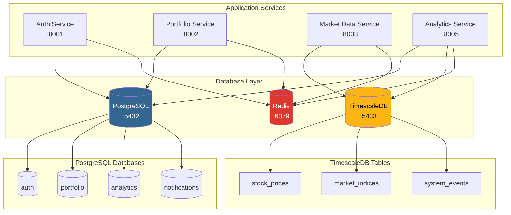

# Database Documentation

This section provides comprehensive documentation for the NexaNest database infrastructure, including schemas, connectivity, and operational procedures.

## Overview

NexaNest uses a multi-database architecture designed for scalability, security, and performance:

- **PostgreSQL**: Main application databases with service isolation
- **TimescaleDB**: Time-series data for market prices and analytics
- **Redis**: Caching and session storage

## Documentation Sections

### [Database Architecture](architecture.md)
High-level overview of the database design, service isolation, and data flow patterns.

### [Schema Documentation](schemas/index.md)
Detailed documentation of all database schemas with Entity-Relationship diagrams:

- [Auth Service Schema](schemas/auth.md) - User authentication and profiles
- [Portfolio Service Schema](schemas/portfolio.md) - Investment portfolios and transactions
- [TimescaleDB Schema](schemas/timescale.md) - Time-series market data

### [Connectivity Guide](connectivity.md)
Connection strings, service communication patterns, and network architecture.

### [Operations Guide](operations.md)
Database management, backup/restore procedures, monitoring, and maintenance.

### [Development Guide](development.md)
Local setup, migrations, testing patterns, and development workflows.

### [Security](security.md)
Row-level security policies, access controls, and compliance features.

## Quick Reference

### Connection Information

| Service | Host | Port | Database | User |
|---------|------|------|----------|------|
| PostgreSQL | localhost | 5432 | auth/portfolio/analytics/notifications | nexanest |
| TimescaleDB | localhost | 5433 | timescale | timescale |
| Redis | localhost | 6379 | 0-15 | N/A |
| PgAdmin | localhost | 5050 | N/A | admin@nexanest.local |

### Quick Commands

```bash
# Start databases
make db-start

# Check status
make db-status

# Connect to PostgreSQL
make db-connect-postgres

# Create backup
make db-backup

# View logs
make db-logs
```

## Database Architecture Overview



## Service-Database Mapping

| Service | Primary Database | Secondary | Cache |
|---------|------------------|-----------|-------|
| Auth Service | PostgreSQL (auth) | - | Redis (sessions) |
| Portfolio Service | PostgreSQL (portfolio) | TimescaleDB (snapshots) | Redis (calculations) |
| Market Data Service | TimescaleDB (timescale) | - | Redis (real-time) |
| Analytics Service | PostgreSQL (analytics) | TimescaleDB (metrics) | Redis (aggregations) |
| Notification Service | PostgreSQL (notifications) | - | Redis (queues) |

## Next Steps

1. **Development Setup**: Follow the [Development Guide](development.md) to set up your local environment
2. **Schema Understanding**: Review the [Schema Documentation](schemas/index.md) for your service
3. **Operations**: Familiarize yourself with the [Operations Guide](operations.md) for maintenance tasks