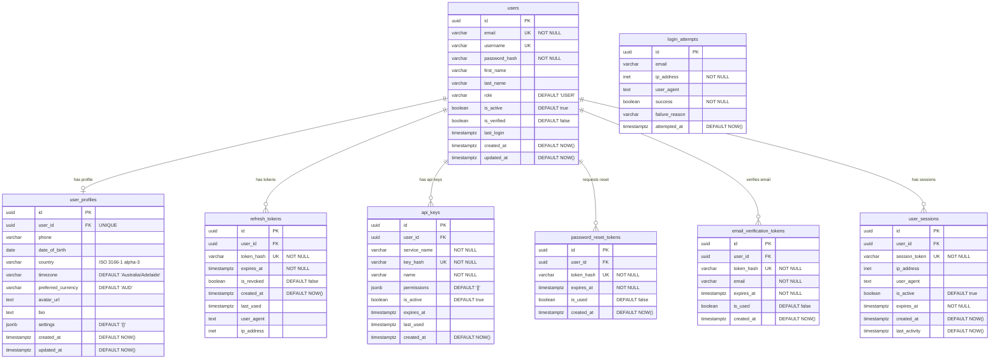

# Auth Service Database Schema

The Auth Service manages user authentication, authorization, and profile data using a dedicated PostgreSQL database.

## Database: `auth`

**Purpose**: User authentication, authorization, and profile management  
**Schema**: `auth`  
**Connection**: PostgreSQL on port 5432  

## Entity Relationship Diagram



## Table Details

### users
Core user account information and authentication data.

**Key Features:**
- UUID primary keys for security
- Email and username unique constraints
- Role-based access control (USER, ADVISOR, ADMIN, SUPERUSER)
- Password hashing with bcrypt
- Account activation and email verification flags

**Constraints:**
- `valid_role`: Ensures role is one of allowed values
- `valid_email`: Email format validation using regex

### user_profiles
Extended user profile information and preferences.

**Key Features:**
- One-to-one relationship with users
- Timezone and currency preferences
- Profile customization (avatar, bio)
- JSONB settings for flexible configuration
- International support (country codes)

### refresh_tokens
JWT refresh token management for secure authentication.

**Key Features:**
- Token rotation and revocation
- Device tracking (user agent, IP)
- Expiration management
- Usage tracking

### api_keys
Service-to-service authentication and user API access.

**Key Features:**
- Named API keys for different purposes
- Granular permissions using JSONB
- Service identification
- Expiration and usage tracking

### Token Tables
Secure token management for various authentication flows:

- **password_reset_tokens**: Password reset workflow
- **email_verification_tokens**: Email verification process

**Security Features:**
- Cryptographically secure token hashing
- Automatic expiration
- Single-use tokens
- User association tracking

### login_attempts
Security monitoring and rate limiting.

**Key Features:**
- Failed login attempt tracking
- IP-based rate limiting
- Fraud detection data
- Success/failure logging

### user_sessions
Active session management and tracking.

**Key Features:**
- Session token management
- Device and location tracking
- Activity monitoring
- Session expiration

## Indexes

Performance-optimized indexes for common query patterns:

```sql
-- User lookups
CREATE INDEX idx_users_email ON auth.users(email);
CREATE INDEX idx_users_username ON auth.users(username);
CREATE INDEX idx_users_role ON auth.users(role);
CREATE INDEX idx_users_active ON auth.users(is_active);

-- Token management
CREATE INDEX idx_refresh_tokens_expires_at ON auth.refresh_tokens(expires_at);
CREATE INDEX idx_refresh_tokens_revoked ON auth.refresh_tokens(is_revoked);

-- Security monitoring
CREATE INDEX idx_login_attempts_ip ON auth.login_attempts(ip_address);
CREATE INDEX idx_login_attempts_attempted_at ON auth.login_attempts(attempted_at);

-- Session management
CREATE INDEX idx_user_sessions_expires_at ON auth.user_sessions(expires_at);
CREATE INDEX idx_user_sessions_active ON auth.user_sessions(is_active);
```

## Security Features

### Row Level Security (RLS)
All tables implement Row Level Security to ensure users can only access their own data:

```sql
-- Users can only see their own data
CREATE POLICY user_own_data ON auth.users 
    FOR ALL TO authenticated 
    USING (id = current_setting('app.current_user_id')::UUID);

-- Similar policies for all user-related tables
```

### Application Roles
Service-specific database roles with minimal required permissions:

- **auth_service**: Full access to auth schema
- **portfolio_service**: Read-only access to users and profiles
- **analytics_service**: Read-only access to users and profiles
- **notification_service**: Read-only access to users and profiles

## Functions and Triggers

### Automatic Timestamp Updates
```sql
CREATE OR REPLACE FUNCTION auth.update_updated_at_column()
RETURNS TRIGGER AS $$
BEGIN
    NEW.updated_at = NOW();
    RETURN NEW;
END;
$$ language 'plpgsql';
```

### Token Cleanup
```sql
CREATE OR REPLACE FUNCTION auth.cleanup_expired_tokens()
RETURNS INTEGER AS $$
-- Automatically removes expired tokens and old data
$$;
```

## Default Data

### System Users
- **admin@nexanest.local**: System administrator (SUPERUSER role)
- **test@nexanest.local**: Test user (USER role)

Both users have default profiles with Australia/Adelaide timezone and AUD currency.

## Common Queries

### User Authentication
```sql
-- Verify user credentials
SELECT id, password_hash, role, is_active, is_verified 
FROM auth.users 
WHERE email = $1;

-- Get user profile
SELECT u.*, p.*
FROM auth.users u
LEFT JOIN auth.user_profiles p ON u.id = p.user_id
WHERE u.id = $1;
```

### Token Management
```sql
-- Create refresh token
INSERT INTO auth.refresh_tokens (user_id, token_hash, expires_at, ip_address, user_agent)
VALUES ($1, $2, $3, $4, $5);

-- Revoke user sessions
UPDATE auth.user_sessions 
SET is_active = false 
WHERE user_id = $1;
```

### Security Monitoring
```sql
-- Check failed login attempts
SELECT COUNT(*) 
FROM auth.login_attempts 
WHERE ip_address = $1 
  AND success = false 
  AND attempted_at > NOW() - INTERVAL '1 hour';
```

## Migration Considerations

When modifying the auth schema:

1. **Backward Compatibility**: Ensure changes don't break existing services
2. **Security Impact**: Review RLS policies and permissions
3. **Data Migration**: Plan for user data transformations
4. **Index Updates**: Update indexes for new query patterns
5. **Function Updates**: Modify triggers and functions as needed

## Related Documentation

- [Security Policies](../security.md)
- [Portfolio Schema](portfolio.md) - Cross-service relationships
- [Operations Guide](../operations.md) - Maintenance procedures