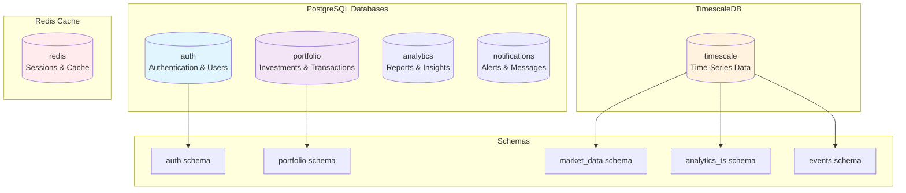
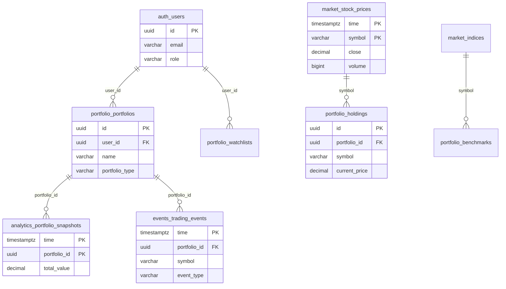
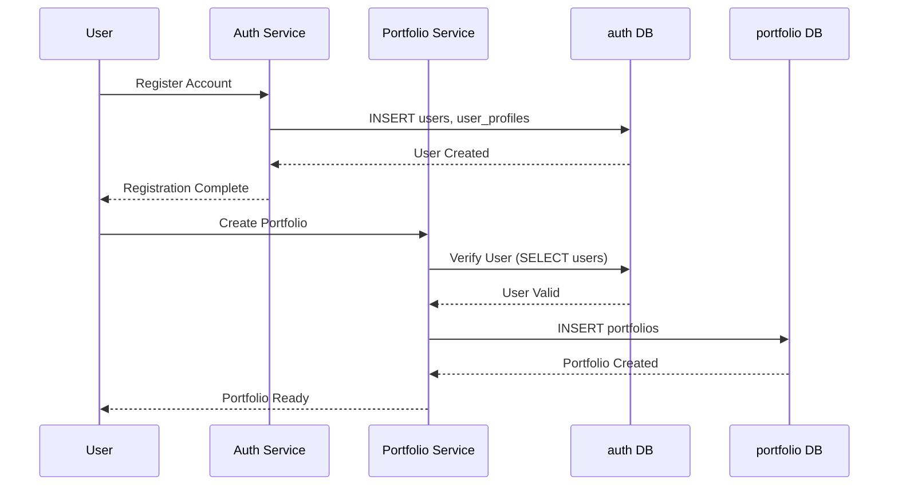
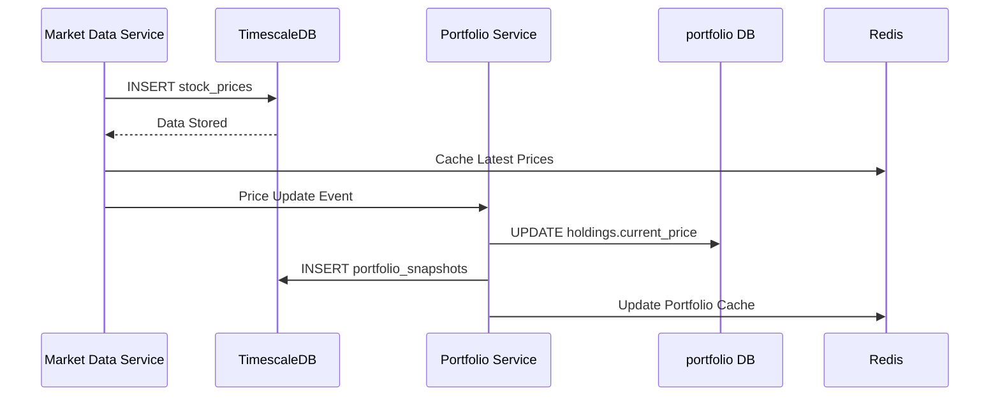
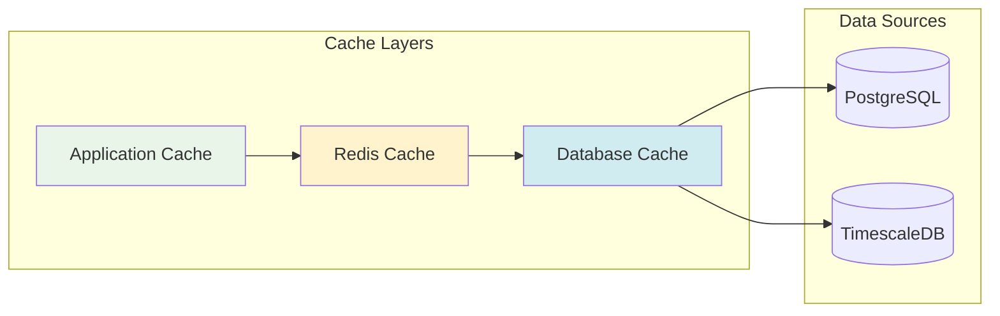

# Database Schemas Overview

This section provides comprehensive documentation for all NexaNest database schemas, including entity relationships, data flows, and integration patterns.

## Schema Architecture

NexaNest employs a multi-database architecture with domain-driven design principles:



## Schema Documentation

### [Auth Service Schema](auth.md)
**Database**: `auth` (PostgreSQL)  
**Purpose**: User authentication, authorization, and profile management

**Key Tables**:
- `users` - Core user accounts and authentication
- `user_profiles` - Extended user information and preferences
- `refresh_tokens` - JWT refresh token management
- `api_keys` - Service-to-service authentication
- `login_attempts` - Security monitoring and rate limiting

**Features**:
- Row-level security for multi-tenant isolation
- Automatic token cleanup and session management
- Role-based access control (USER, ADVISOR, ADMIN, SUPERUSER)
- Email verification and password reset workflows

### [Portfolio Service Schema](portfolio.md)
**Database**: `portfolio` (PostgreSQL)  
**Purpose**: Investment portfolio management and transaction tracking

**Key Tables**:
- `portfolios` - User investment portfolios
- `holdings` - Individual asset positions
- `transactions` - Complete transaction history
- `portfolio_snapshots` - Daily performance tracking
- `watchlists` - Asset tracking and alerts
- `allocation_rules` - Rebalancing automation

**Features**:
- Automatic market value calculation
- Multi-currency support with exchange rates
- Performance analytics and benchmarking
- Goal tracking and progress monitoring

### [TimescaleDB Schema](timescale.md)
**Database**: `timescale` (TimescaleDB)  
**Purpose**: Time-series data for market prices and analytics

**Key Hypertables**:
- `market_data.stock_prices` - Real-time stock prices
- `market_data.market_indices` - Market index values
- `analytics_ts.portfolio_snapshots` - Portfolio performance over time
- `events.system_events` - System audit trail
- `events.trading_events` - Trading activity log

**Features**:
- Automatic data partitioning by time
- Continuous aggregates for performance
- Data retention and compression policies
- High-frequency data ingestion optimization

## Cross-Schema Relationships



## Data Flow Patterns

### User Registration and Portfolio Creation


### Market Data Processing and Portfolio Updates


## Schema Design Principles

### Domain Separation
- **Auth Domain**: User identity and access management
- **Portfolio Domain**: Investment and transaction management
- **Market Domain**: Real-time and historical market data
- **Analytics Domain**: Performance metrics and insights
- **Events Domain**: Audit trails and system monitoring

### Data Consistency
- **Eventual Consistency**: Between PostgreSQL and TimescaleDB
- **Strong Consistency**: Within each PostgreSQL database
- **Cache Consistency**: Redis cache invalidation on data changes

### Security and Privacy
- **Row-Level Security**: Users can only access their own data
- **Service Isolation**: Each service has dedicated database roles
- **Data Encryption**: Sensitive fields encrypted at rest
- **Audit Logging**: All data changes tracked in TimescaleDB

## Performance Considerations

### Indexing Strategy
```sql
-- Optimized for user lookups
CREATE INDEX idx_users_email ON auth.users(email);

-- Portfolio operations
CREATE INDEX idx_portfolios_user_id ON portfolio.portfolios(user_id);
CREATE INDEX idx_holdings_portfolio_symbol ON portfolio.holdings(portfolio_id, symbol);

-- Time-series queries
CREATE INDEX idx_stock_prices_symbol_time ON market_data.stock_prices(symbol, time DESC);
```

### Query Optimization
- **Covering Indexes**: Include frequently accessed columns
- **Partial Indexes**: Filter on commonly used conditions
- **Composite Indexes**: Multi-column indexes for complex queries
- **Time-based Partitioning**: Automatic in TimescaleDB hypertables

### Caching Strategy


## Migration and Evolution

### Schema Versioning
- **Semantic Versioning**: Major.Minor.Patch for schema changes
- **Migration Scripts**: Automated database updates
- **Rollback Plans**: Ability to revert schema changes
- **Testing**: All migrations tested in staging environment

### Backward Compatibility
- **Additive Changes**: New columns with defaults
- **Deprecation Process**: Gradual removal of old fields
- **API Versioning**: Service APIs maintain compatibility
- **Documentation**: Change logs and migration guides

## Common Query Patterns

### User Portfolio Summary
```sql
-- Get user's portfolios with current values
SELECT 
    p.id,
    p.name,
    p.portfolio_type,
    p.currency,
    COUNT(h.id) as holdings_count,
    SUM(h.market_value) as total_value
FROM portfolio.portfolios p
LEFT JOIN portfolio.holdings h ON p.id = h.portfolio_id
WHERE p.user_id = $1 AND p.is_active = true
GROUP BY p.id, p.name, p.portfolio_type, p.currency;
```

### Performance Analytics
```sql
-- Portfolio performance over time
SELECT 
    ps.time::date as date,
    ps.total_value,
    ps.day_change_percent,
    ps.total_return_percent
FROM analytics_ts.portfolio_snapshots ps
WHERE ps.portfolio_id = $1
  AND ps.time >= $2
ORDER BY ps.time;
```

### Market Data Integration
```sql
-- Update holdings with latest prices
UPDATE portfolio.holdings h
SET current_price = sp.close,
    last_updated = NOW()
FROM (
    SELECT DISTINCT ON (symbol) symbol, close
    FROM market_data.stock_prices
    WHERE time >= NOW() - INTERVAL '1 hour'
    ORDER BY symbol, time DESC
) sp
WHERE h.symbol = sp.symbol;
```

## Related Documentation

- [Database Architecture](../architecture.md) - High-level database design
- [Connectivity Guide](../connectivity.md) - Connection patterns and security
- [Operations Guide](../operations.md) - Backup, monitoring, and maintenance
- [Development Guide](../development.md) - Local setup and testing procedures