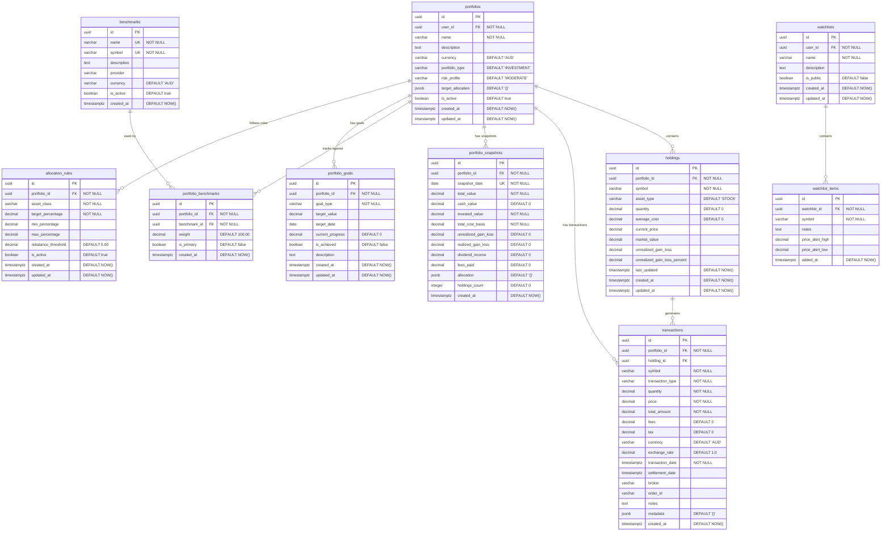

# Portfolio Service Database Schema

The Portfolio Service manages investment portfolios, holdings, transactions, and performance tracking using a dedicated PostgreSQL database.

## Database: `portfolio`

**Purpose**: Investment portfolio management, transactions, and performance analytics  
**Schema**: `portfolio`  
**Connection**: PostgreSQL on port 5432  

## Entity Relationship Diagram



## Table Details

### portfolios
Core portfolio entities representing user investment accounts.

**Key Features:**
- Multi-portfolio support per user
- Portfolio type categorization (INVESTMENT, RETIREMENT, SAVINGS, TRADING, EDUCATION)
- Risk profile management (CONSERVATIVE, MODERATE, AGGRESSIVE, CUSTOM)
- Target allocation tracking with JSONB flexibility
- Multi-currency support

**Constraints:**
- `valid_portfolio_type`: Enforces allowed portfolio types
- `valid_risk_profile`: Enforces risk profile values
- `valid_currency`: Ensures 3-letter currency codes

### holdings
Individual asset positions within portfolios.

**Key Features:**
- Real-time position tracking
- Automatic market value calculation
- Unrealized gain/loss computation
- Multi-asset type support (STOCK, ETF, BOND, OPTION, FUTURE, CRYPTO, CASH, COMMODITY)
- Cost basis tracking
- Price update timestamps

**Calculated Fields:**
- `market_value`: quantity × current_price
- `unrealized_gain_loss`: market_value - (quantity × average_cost)
- `unrealized_gain_loss_percent`: (unrealized_gain_loss / cost_basis) × 100

### transactions
Complete transaction history with detailed metadata.

**Key Features:**
- Comprehensive transaction types (BUY, SELL, DIVIDEND, SPLIT, MERGER, SPINOFF, DEPOSIT, WITHDRAWAL, FEE, TAX)
- Fee and tax tracking
- Multi-currency support with exchange rates
- Broker and order tracking
- Settlement date management
- Flexible metadata storage

### portfolio_snapshots
Daily portfolio performance tracking for analytics.

**Key Features:**
- Point-in-time portfolio valuation
- Performance metrics (realized/unrealized gains, dividends, fees)
- Asset allocation snapshots
- Holdings count tracking
- Unique constraint on portfolio_id + snapshot_date

### benchmarks & portfolio_benchmarks
Performance comparison against market indices.

**Key Features:**
- Predefined market benchmarks (ASX 200, S&P 500, etc.)
- Weighted benchmark comparisons
- Primary benchmark designation
- Multi-benchmark support per portfolio

### watchlists & watchlist_items
Asset tracking and price alerts.

**Key Features:**
- Personal and public watchlists
- Price alert thresholds
- Symbol tracking with notes
- User-specific organization

### portfolio_goals
Investment goal tracking and progress monitoring.

**Key Features:**
- Goal categorization (RETIREMENT, HOUSE_DEPOSIT, VACATION, EDUCATION, EMERGENCY_FUND, GENERAL_WEALTH, CUSTOM)
- Target value and date tracking
- Progress calculation
- Achievement status

### allocation_rules
Automated portfolio rebalancing rules.

**Key Features:**
- Asset class percentage targets
- Min/max percentage constraints
- Rebalancing threshold triggers
- Active/inactive rule management

## Indexes

Performance-optimized indexes for portfolio operations:

```sql
-- Portfolio operations
CREATE INDEX idx_portfolios_user_id ON portfolio.portfolios(user_id);
CREATE INDEX idx_portfolios_active ON portfolio.portfolios(is_active);
CREATE INDEX idx_portfolios_type ON portfolio.portfolios(portfolio_type);

-- Holdings lookups
CREATE INDEX idx_holdings_portfolio_id ON portfolio.holdings(portfolio_id);
CREATE INDEX idx_holdings_symbol ON portfolio.holdings(symbol);
CREATE INDEX idx_holdings_asset_type ON portfolio.holdings(asset_type);
CREATE INDEX idx_holdings_updated ON portfolio.holdings(last_updated);

-- Transaction queries
CREATE INDEX idx_transactions_portfolio_id ON portfolio.transactions(portfolio_id);
CREATE INDEX idx_transactions_symbol ON portfolio.transactions(symbol);
CREATE INDEX idx_transactions_type ON portfolio.transactions(transaction_type);
CREATE INDEX idx_transactions_date ON portfolio.transactions(transaction_date);

-- Performance analysis
CREATE INDEX idx_snapshots_portfolio_id ON portfolio.portfolio_snapshots(portfolio_id);
CREATE INDEX idx_snapshots_date ON portfolio.portfolio_snapshots(snapshot_date);

-- Watchlist operations
CREATE INDEX idx_watchlists_user_id ON portfolio.watchlists(user_id);
CREATE INDEX idx_watchlist_items_symbol ON portfolio.watchlist_items(symbol);
```

## Functions and Triggers

### Automatic Value Calculations
```sql
CREATE OR REPLACE FUNCTION portfolio.update_holding_market_value()
RETURNS TRIGGER AS $$
BEGIN
    NEW.market_value = NEW.quantity * COALESCE(NEW.current_price, NEW.average_cost);
    NEW.unrealized_gain_loss = NEW.market_value - (NEW.quantity * NEW.average_cost);
    
    IF NEW.quantity * NEW.average_cost > 0 THEN
        NEW.unrealized_gain_loss_percent = (NEW.unrealized_gain_loss / (NEW.quantity * NEW.average_cost)) * 100;
    ELSE
        NEW.unrealized_gain_loss_percent = 0;
    END IF;
    
    NEW.last_updated = NOW();
    RETURN NEW;
END;
$$ LANGUAGE plpgsql;
```

### Portfolio Value Calculation
```sql
CREATE OR REPLACE FUNCTION portfolio.calculate_portfolio_value(p_portfolio_id UUID)
RETURNS DECIMAL(15,2) AS $$
DECLARE
    total_value DECIMAL(15,2) := 0;
BEGIN
    SELECT COALESCE(SUM(market_value), 0) 
    INTO total_value
    FROM portfolio.holdings 
    WHERE portfolio_id = p_portfolio_id;
    
    RETURN total_value;
END;
$$ LANGUAGE plpgsql;
```

## Security Features

### Row Level Security (RLS)
Multi-tenant data isolation ensuring users only access their own data:

```sql
-- Users can only access their own portfolios
CREATE POLICY user_own_portfolios ON portfolio.portfolios 
    FOR ALL TO authenticated 
    USING (user_id = current_setting('app.current_user_id')::UUID);

-- Holdings accessible through portfolio ownership
CREATE POLICY user_portfolio_holdings ON portfolio.holdings 
    FOR ALL TO authenticated 
    USING (portfolio_id IN (
        SELECT id FROM portfolio.portfolios 
        WHERE user_id = current_setting('app.current_user_id')::UUID
    ));
```

### Application Roles
- **portfolio_service_write**: Full read/write access to portfolio schema
- **portfolio_service_read**: Read-only access for analytics and reporting

## Default Data

### Market Benchmarks
Pre-loaded with major market indices:
- **Australian**: All Ordinaries (XAO), ASX 200 (XJO), ASX Small Ordinaries (XSO)
- **International**: S&P 500 (SPX), NASDAQ (IXIC), FTSE 100 (UKX), Nikkei 225 (NKY)

## Common Queries

### Portfolio Overview
```sql
-- Get portfolio with current value
SELECT p.*, 
       portfolio.calculate_portfolio_value(p.id) as current_value,
       COUNT(h.id) as holdings_count
FROM portfolio.portfolios p
LEFT JOIN portfolio.holdings h ON p.id = h.portfolio_id
WHERE p.user_id = $1 AND p.is_active = true
GROUP BY p.id;
```

### Holdings Summary
```sql
-- Portfolio holdings with performance
SELECT h.symbol, h.quantity, h.average_cost, h.current_price,
       h.market_value, h.unrealized_gain_loss, h.unrealized_gain_loss_percent
FROM portfolio.holdings h
WHERE h.portfolio_id = $1
ORDER BY h.market_value DESC;
```

### Transaction History
```sql
-- Recent transactions
SELECT t.symbol, t.transaction_type, t.quantity, t.price, 
       t.total_amount, t.fees, t.transaction_date
FROM portfolio.transactions t
WHERE t.portfolio_id = $1
ORDER BY t.transaction_date DESC
LIMIT 50;
```

### Performance Analytics
```sql
-- Portfolio performance over time
SELECT snapshot_date, total_value, unrealized_gain_loss, 
       realized_gain_loss, dividend_income
FROM portfolio.portfolio_snapshots
WHERE portfolio_id = $1
ORDER BY snapshot_date DESC
LIMIT 365;
```

## Data Flow Patterns

### Transaction Processing
1. **Transaction Creation**: New transaction recorded with metadata
2. **Holdings Update**: Quantity and average cost recalculated
3. **Market Value Update**: Triggered by price updates from market data service
4. **Snapshot Creation**: Daily aggregation for performance tracking

### Price Update Flow
1. **Market Data Service**: Receives real-time prices
2. **Holdings Update**: Current prices updated via trigger
3. **Cache Update**: Redis cache refreshed for real-time queries
4. **Notification Service**: Price alerts triggered if thresholds exceeded

## Performance Considerations

### Optimizations
- **Calculated Fields**: Market values computed via triggers
- **Snapshot Strategy**: Daily snapshots reduce computation for historical analysis
- **Index Strategy**: Covering indexes for common query patterns
- **Partitioning**: Consider partitioning transactions by date for large datasets

### Scaling Strategies
- **Read Replicas**: Portfolio queries can use read-only replicas
- **Cache Layer**: Redis caching for frequently accessed portfolio data
- **Batch Processing**: Bulk price updates and snapshot generation
- **Archive Strategy**: Historical data archival for older transactions

## Related Documentation

- [Auth Schema](auth.md) - User relationships
- [TimescaleDB Schema](timescale.md) - Time-series market data integration
- [Operations Guide](../operations.md) - Backup and maintenance procedures
- [Development Guide](../development.md) - Local setup and testing