# TimescaleDB Schema Documentation

TimescaleDB serves as the time-series database for NexaNest, optimized for high-frequency market data, analytics, and event tracking.

## Database: `timescale`

**Purpose**: Time-series data storage and analytics  
**Engine**: TimescaleDB (PostgreSQL extension)  
**Connection**: PostgreSQL protocol on port 5433  
**Retention**: Configurable per hypertable  

## Schema Overview

```mermaid
erDiagram
    stock_prices {
        timestamptz time PK
        varchar symbol PK
        decimal open "NOT NULL"
        decimal high "NOT NULL"
        decimal low "NOT NULL"
        decimal close "NOT NULL"
        decimal adjusted_close
        bigint volume "DEFAULT 0"
        decimal vwap
        varchar currency "DEFAULT 'AUD'"
        varchar exchange
        varchar source
        jsonb metadata "DEFAULT '{}'"
    }
    
    market_indices {
        timestamptz time PK
        varchar index_symbol PK
        decimal value "NOT NULL"
        decimal change_amount
        decimal change_percent
        bigint volume
        varchar currency "DEFAULT 'AUD'"
        varchar exchange
        varchar source
        jsonb metadata "DEFAULT '{}'"
    }
    
    currency_rates {
        timestamptz time PK
        varchar from_currency PK
        varchar to_currency PK
        decimal rate "NOT NULL"
        decimal bid
        decimal ask
        varchar source
        jsonb metadata "DEFAULT '{}'"
    }
    
    portfolio_snapshots {
        timestamptz time PK
        uuid portfolio_id PK
        decimal total_value "NOT NULL"
        decimal cash_value "DEFAULT 0"
        decimal invested_value "NOT NULL"
        decimal day_change
        decimal day_change_percent
        decimal total_return
        decimal total_return_percent
        jsonb allocation "DEFAULT '{}'"
        jsonb holdings_summary "DEFAULT '{}'"
        integer holdings_count "DEFAULT 0"
    }
    
    risk_metrics {
        timestamptz time PK
        uuid portfolio_id PK
        varchar metric_type PK
        decimal value "NOT NULL"
        decimal percentile_rank
        jsonb details "DEFAULT '{}'"
        varchar calculation_method
    }
    
    system_events {
        timestamptz time PK
        uuid event_id PK
        varchar event_type "NOT NULL"
        varchar service_name "NOT NULL"
        varchar severity "DEFAULT 'INFO'"
        text message
        jsonb details "DEFAULT '{}'"
        varchar user_id
        varchar session_id
        inet ip_address
    }
    
    trading_events {
        timestamptz time PK
        uuid event_id PK
        uuid portfolio_id
        varchar symbol
        varchar event_type "NOT NULL"
        decimal quantity
        decimal price
        decimal total_value
        varchar currency "DEFAULT 'AUD'"
        varchar broker
        varchar order_id
        jsonb metadata "DEFAULT '{}'"
    }
```



## Hypertable Configuration

### Market Data Tables

#### stock_prices
**Partitioning**: By time (1 day intervals) and symbol (hash)
```sql
SELECT create_hypertable('market_data.stock_prices', 'time', 
                        partitioning_column => 'symbol',
                        number_partitions => 4);
```

**Retention Policy**: 2 years for minute data, 10 years for daily aggregates
```sql
SELECT add_retention_policy('market_data.stock_prices', INTERVAL '2 years');
```

**Compression**: Enabled after 7 days
```sql
SELECT add_compression_policy('market_data.stock_prices', INTERVAL '7 days');
```

#### market_indices
**Partitioning**: By time (1 day intervals)
```sql
SELECT create_hypertable('market_data.market_indices', 'time');
```

**Retention**: 5 years
```sql
SELECT add_retention_policy('market_data.market_indices', INTERVAL '5 years');
```

#### currency_rates
**Partitioning**: By time (1 hour intervals)
```sql
SELECT create_hypertable('market_data.currency_rates', 'time', 
                        chunk_time_interval => INTERVAL '1 hour');
```

### Analytics Tables

#### portfolio_snapshots
**Partitioning**: By time (1 day intervals) and portfolio_id
```sql
SELECT create_hypertable('analytics_ts.portfolio_snapshots', 'time',
                        partitioning_column => 'portfolio_id',
                        number_partitions => 8);
```

**Retention**: 7 years for compliance
```sql
SELECT add_retention_policy('analytics_ts.portfolio_snapshots', INTERVAL '7 years');
```

#### risk_metrics
**Partitioning**: By time (1 day intervals)
```sql
SELECT create_hypertable('analytics_ts.risk_metrics', 'time');
```

### Event Logging Tables

#### system_events
**Partitioning**: By time (1 hour intervals)
```sql
SELECT create_hypertable('events.system_events', 'time',
                        chunk_time_interval => INTERVAL '1 hour');
```

**Retention**: 90 days for performance
```sql
SELECT add_retention_policy('events.system_events', INTERVAL '90 days');
```

#### trading_events
**Partitioning**: By time (1 day intervals)
```sql
SELECT create_hypertable('events.trading_events', 'time');
```

**Retention**: 7 years for compliance
```sql
SELECT add_retention_policy('events.trading_events', INTERVAL '7 years');
```

## Continuous Aggregates

### Daily Stock Prices
```sql
CREATE MATERIALIZED VIEW daily_stock_prices
WITH (timescaledb.continuous) AS
SELECT time_bucket('1 day', time) AS day,
       symbol,
       first(open, time) AS open,
       max(high) AS high,
       min(low) AS low,
       last(close, time) AS close,
       sum(volume) AS volume,
       avg(close) AS avg_price
FROM market_data.stock_prices
GROUP BY day, symbol;
```

### Hourly Portfolio Performance
```sql
CREATE MATERIALIZED VIEW hourly_portfolio_performance
WITH (timescaledb.continuous) AS
SELECT time_bucket('1 hour', time) AS hour,
       portfolio_id,
       avg(total_value) AS avg_value,
       max(total_value) AS max_value,
       min(total_value) AS min_value,
       last(total_value, time) AS close_value
FROM analytics_ts.portfolio_snapshots
GROUP BY hour, portfolio_id;
```

### Weekly Risk Metrics
```sql
CREATE MATERIALIZED VIEW weekly_risk_summary
WITH (timescaledb.continuous) AS
SELECT time_bucket('1 week', time) AS week,
       portfolio_id,
       metric_type,
       avg(value) AS avg_value,
       max(value) AS max_value,
       min(value) AS min_value,
       stddev(value) AS volatility
FROM analytics_ts.risk_metrics
GROUP BY week, portfolio_id, metric_type;
```

## Indexes

### Time-Series Optimized Indexes
```sql
-- Stock prices - optimized for symbol and time queries
CREATE INDEX idx_stock_prices_symbol_time ON market_data.stock_prices (symbol, time DESC);
CREATE INDEX idx_stock_prices_time_symbol ON market_data.stock_prices (time DESC, symbol);

-- Market indices - optimized for index lookups
CREATE INDEX idx_market_indices_symbol_time ON market_data.market_indices (index_symbol, time DESC);

-- Portfolio snapshots - optimized for portfolio queries
CREATE INDEX idx_portfolio_snapshots_portfolio_time ON analytics_ts.portfolio_snapshots (portfolio_id, time DESC);

-- System events - optimized for monitoring queries
CREATE INDEX idx_system_events_service_time ON events.system_events (service_name, time DESC);
CREATE INDEX idx_system_events_severity_time ON events.system_events (severity, time DESC);

-- Trading events - optimized for portfolio and symbol queries
CREATE INDEX idx_trading_events_portfolio_time ON events.trading_events (portfolio_id, time DESC);
CREATE INDEX idx_trading_events_symbol_time ON events.trading_events (symbol, time DESC);
```

## Data Ingestion Patterns

### Real-Time Market Data
```sql
-- Bulk insert pattern for market data
INSERT INTO market_data.stock_prices (time, symbol, open, high, low, close, volume, source)
VALUES 
    ('2025-05-31 14:30:00+09:30', 'CBA.AX', 105.50, 106.20, 105.30, 106.00, 125000, 'ASX'),
    ('2025-05-31 14:30:00+09:30', 'ANZ.AX', 28.45, 28.60, 28.40, 28.55, 89000, 'ASX'),
    ('2025-05-31 14:30:00+09:30', 'WBC.AX', 25.20, 25.35, 25.15, 25.30, 156000, 'ASX')
ON CONFLICT (time, symbol) DO UPDATE SET
    open = EXCLUDED.open,
    high = EXCLUDED.high,
    low = EXCLUDED.low,
    close = EXCLUDED.close,
    volume = EXCLUDED.volume,
    adjusted_close = EXCLUDED.adjusted_close,
    vwap = EXCLUDED.vwap,
    source = EXCLUDED.source,
    metadata = EXCLUDED.metadata;
```

### Portfolio Snapshots
```sql
-- Daily portfolio snapshot creation
WITH portfolio_values AS (
    SELECT 
        p.id as portfolio_id,
        SUM(h.market_value) as total_value,
        SUM(CASE WHEN h.asset_type = 'CASH' THEN h.market_value ELSE 0 END) as cash_value,
        SUM(CASE WHEN h.asset_type != 'CASH' THEN h.market_value ELSE 0 END) as invested_value,
        COUNT(h.id) as holdings_count
    FROM portfolio.portfolios p
    LEFT JOIN portfolio.holdings h ON p.id = h.portfolio_id
    WHERE p.is_active = true
    GROUP BY p.id
)
INSERT INTO analytics_ts.portfolio_snapshots (
    time, portfolio_id, total_value, cash_value, invested_value, holdings_count
)
SELECT 
    date_trunc('day', NOW() AT TIME ZONE 'Australia/Adelaide') as time,
    portfolio_id,
    total_value,
    cash_value,
    invested_value,
    holdings_count
FROM portfolio_values;
```

## Query Patterns

### Market Data Queries

#### Latest Stock Prices
```sql
-- Get latest prices for multiple symbols
SELECT DISTINCT ON (symbol)
    symbol, time, close, volume, change_percent
FROM market_data.stock_prices
WHERE symbol = ANY($1)
ORDER BY symbol, time DESC;
```

#### Price History
```sql
-- Get historical prices for charting
SELECT time, open, high, low, close, volume
FROM market_data.stock_prices
WHERE symbol = $1
  AND time >= $2
  AND time <= $3
ORDER BY time;
```

#### Market Index Performance
```sql
-- Get index performance over time
SELECT 
    time_bucket('1 day', time) as day,
    index_symbol,
    first(value, time) as open_value,
    max(value) as high_value,
    min(value) as low_value,
    last(value, time) as close_value
FROM market_data.market_indices
WHERE index_symbol = $1
  AND time >= NOW() - INTERVAL '1 year'
GROUP BY day, index_symbol
ORDER BY day;
```

### Analytics Queries

#### Portfolio Performance
```sql
-- Portfolio performance over time
SELECT 
    time,
    total_value,
    day_change,
    day_change_percent,
    total_return_percent
FROM analytics_ts.portfolio_snapshots
WHERE portfolio_id = $1
  AND time >= $2
ORDER BY time;
```

#### Risk Metrics Analysis
```sql
-- Risk metrics trends
SELECT 
    time_bucket('1 week', time) as week,
    metric_type,
    avg(value) as avg_risk,
    max(value) as max_risk,
    min(value) as min_risk
FROM analytics_ts.risk_metrics
WHERE portfolio_id = $1
  AND time >= NOW() - INTERVAL '6 months'
GROUP BY week, metric_type
ORDER BY week, metric_type;
```

### Event Analysis

#### System Health Monitoring
```sql
-- Error rate by service
SELECT 
    time_bucket('1 hour', time) as hour,
    service_name,
    count(*) filter (where severity IN ('ERROR', 'CRITICAL')) as error_count,
    count(*) as total_events
FROM events.system_events
WHERE time >= NOW() - INTERVAL '24 hours'
GROUP BY hour, service_name
ORDER BY hour, service_name;
```

#### Trading Activity Analysis
```sql
-- Trading volume by symbol
SELECT 
    time_bucket('1 day', time) as day,
    symbol,
    count(*) as trade_count,
    sum(total_value) as total_volume
FROM events.trading_events
WHERE event_type IN ('BUY', 'SELL')
  AND time >= NOW() - INTERVAL '30 days'
GROUP BY day, symbol
ORDER BY day, total_volume DESC;
```

## Data Retention and Archival

### Retention Policies
```sql
-- View all retention policies
SELECT hypertable_name, policy_name, config
FROM timescaledb_information.policies
WHERE policy_type = 'retention';

-- Modify retention policy
SELECT remove_retention_policy('market_data.stock_prices');
SELECT add_retention_policy('market_data.stock_prices', INTERVAL '3 years');
```

### Compression Policies
```sql
-- View compression status
SELECT 
    hypertable_name,
    compression_enabled,
    compress_after
FROM timescaledb_information.hypertables;

-- Add compression policy
SELECT add_compression_policy('market_data.stock_prices', INTERVAL '30 days');
```

### Manual Data Management
```sql
-- Drop old chunks manually
SELECT drop_chunks('market_data.stock_prices', INTERVAL '3 years');

-- Compress specific chunks
SELECT compress_chunk(chunk_name)
FROM timescaledb_information.chunks
WHERE hypertable_name = 'market_data.stock_prices'
  AND range_end < NOW() - INTERVAL '30 days';
```

## Performance Optimization

### Query Performance
```sql
-- Analyze query performance
EXPLAIN (ANALYZE, BUFFERS) 
SELECT symbol, time, close
FROM market_data.stock_prices
WHERE symbol = 'CBA.AX'
  AND time >= NOW() - INTERVAL '1 day'
ORDER BY time DESC;
```

### Chunk Management
```sql
-- View chunk information
SELECT 
    chunk_name,
    hypertable_name,
    range_start,
    range_end,
    pg_size_pretty(chunk_size) as size
FROM timescaledb_information.chunks
ORDER BY range_start DESC;
```

### Statistics and Monitoring
```sql
-- Hypertable statistics
SELECT 
    hypertable_name,
    num_chunks,
    num_dimensions,
    compression_enabled
FROM timescaledb_information.hypertables;

-- Continuous aggregate refresh status
SELECT 
    view_name,
    refresh_lag,
    last_run_status
FROM timescaledb_information.continuous_aggregates;
```

## Related Documentation

- [Database Architecture](../architecture.md)
- [Market Data Service](../../services/market-data.md)
- [Analytics Service](../../services/analytics.md)
- [Operations Guide](../operations.md)