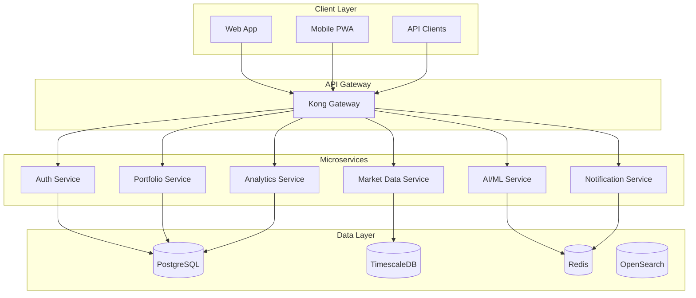

# NexaNest Documentation

Welcome to the NexaNest documentation. NexaNest is a next-generation investment portfolio management platform that
democratizes institutional-grade financial analytics through AI.

## What is NexaNest?

NexaNest provides sophisticated investment insights and portfolio management capabilities typically available only to
institutional investors, making them accessible to individual investors and financial advisors.

## Key Features

- **📊 Portfolio Management**

  ______________________________________________________________________

  Create and manage multiple investment portfolios with real-time tracking and performance analytics

- **📈 Market Data**

  ______________________________________________________________________

  Access real-time and historical market data with advanced technical indicators

- **🤖 AI-Powered Insights**

  ______________________________________________________________________

  Natural language portfolio analysis and personalized investment recommendations

- **🛡️ Enterprise Security**

  ______________________________________________________________________

  SOC 2 compliant architecture with end-to-end encryption and multi-factor authentication

## Architecture Overview

## Quick Links

- [🎯 Mission & Vision](mission-vision.md)
- [🚀 Quick Start Guide](getting-started/quickstart.md)
- [🏗️ System Architecture](architecture/ARCHITECTURE.md)
- [🔐 Secrets Management](infrastructure/secrets-management.md)
- [📡 API Reference](api/rest.md)
- [📚 Development Guide](development/IMPLEMENTATION_PLAN.md)

## Project Status

!!! info "Proof of Concept Phase"
NexaNest is currently in the POC phase. We're validating the architecture and core features before moving to
production development.

## Getting Help

- **GitHub Issues**: Report bugs and request features
- **Discussions**: Ask questions and share ideas
- **Documentation**: You're already here!

## Contributing

We welcome contributions! Please see our [Development Guidelines](development/guidelines.md) for more information.

______________________________________________________________________
