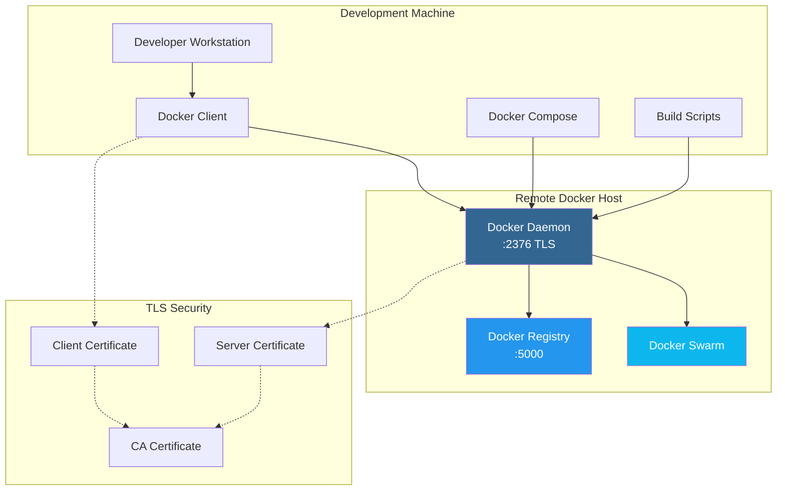

# Remote Docker Host Setup Guide

This guide explains how to set up remote access to a Docker host that will run both the Docker registry and Docker Swarm for NexaNest.

## Overview

The setup involves:
1. **Remote Docker Host**: Runs Docker daemon, registry, and swarm
2. **Development Machine**: Connects remotely to build and deploy
3. **TLS Security**: Encrypted communication between client and daemon
4. **Registry Access**: Centralized image storage for swarm deployment

## Architecture



## Prerequisites

### Remote Docker Host Requirements
- Ubuntu 20.04+ or similar Linux distribution
- Docker Engine 20.10+ installed
- SSH access with sudo privileges
- Public IP address or accessible network location
- Firewall configured for ports 22 (SSH), 2376 (Docker), 5000 (Registry)

### Development Machine Requirements
- Docker client installed
- OpenSSL for certificate generation
- SSH client for remote access
- Git and project repository

## Step-by-Step Setup

### 1. Prepare Remote Docker Host

First, ensure Docker is installed on your remote host:

```bash
# On the remote host
sudo apt update
sudo apt install -y docker.io docker-compose
sudo systemctl enable docker
sudo systemctl start docker
sudo usermod -aG docker $USER
```

### 2. Generate TLS Certificates

From your development machine, generate certificates for secure communication:

```bash
# Set your Docker host IP
export DOCKER_HOST_IP="YOUR_DOCKER_HOST_IP"

# Generate certificates
./scripts/setup-remote-docker.sh generate-certs --host $DOCKER_HOST_IP
```

This creates certificates in `~/.docker/nexanest/`:
- `ca.pem` - Certificate Authority
- `cert.pem` - Client certificate
- `key.pem` - Client private key
- `server-cert.pem` - Server certificate
- `server-key.pem` - Server private key

### 3. Configure Docker Daemon

Configure the remote Docker daemon for TLS access:

```bash
# Configure daemon (requires SSH access)
./scripts/setup-remote-docker.sh configure-daemon --host $DOCKER_HOST_IP --user ubuntu
```

This script:
- Copies server certificates to `/etc/docker/certs/`
- Creates `/etc/docker/daemon.json` with TLS configuration
- Creates systemd override for Docker service
- Restarts Docker daemon with new configuration

### 4. Set Up Client Configuration

Configure your local Docker client:

```bash
# Set up client certificates and configuration
./scripts/setup-remote-docker.sh setup-client --host $DOCKER_HOST_IP
```

This creates:
- `docker-config.sh` - Environment variables for remote access
- `docker-aliases.sh` - Convenient command aliases

### 5. Test Remote Connection

Verify the connection works:

```bash
# Test basic connection
./scripts/setup-remote-docker.sh test-connection --host $DOCKER_HOST_IP

# Or manually test
source ~/.docker/nexanest/docker-config.sh
docker version
docker info
```

### 6. Deploy Docker Registry

Deploy the registry to your remote host:

```bash
# Deploy registry
./scripts/setup-remote-docker.sh deploy-registry --host $DOCKER_HOST_IP

# Or manually with environment
source ~/.docker/nexanest/docker-config.sh
./scripts/registry-manage.sh start
```

## Usage Patterns

### Environment Configuration

Source the configuration files to enable remote Docker:

```bash
# Enable remote Docker access
source ~/.docker/nexanest/docker-config.sh
source ~/.docker/nexanest/docker-aliases.sh

# Verify connection
docker version
```

### Building and Pushing Images

Build and push images to the remote registry:

```bash
# With environment configured
./scripts/build-and-push.sh

# Or using alias
build-nexanest --version v1.0.0
```

### Registry Management

Manage the remote registry:

```bash
# Check registry status
registry-nexanest status

# List images in registry
registry-nexanest list

# Test registry functionality
registry-nexanest test
```

### Swarm Deployment

Deploy to the remote swarm:

```bash
# Initialize swarm (if not already done)
docker swarm init

# Deploy stack
make deploy-swarm

# Check deployment
make swarm-ps
```

## Configuration Files

### Docker Daemon Configuration

The daemon configuration (`/etc/docker/daemon.json`) includes:

```json
{
  "hosts": ["unix:///var/run/docker.sock", "tcp://0.0.0.0:2376"],
  "tls": true,
  "tlscert": "/etc/docker/certs/server-cert.pem",
  "tlskey": "/etc/docker/certs/server-key.pem",
  "tlsverify": true,
  "tlscacert": "/etc/docker/certs/ca.pem",
  "insecure-registries": ["localhost:5000", "DOCKER_HOST_IP:5000"],
  "log-driver": "json-file",
  "log-opts": {
    "max-size": "10m",
    "max-file": "3"
  }
}
```

### Client Environment

The client configuration sets these variables:

```bash
export DOCKER_HOST="tcp://DOCKER_HOST_IP:2376"
export DOCKER_TLS_VERIFY=1
export DOCKER_CERT_PATH="~/.docker/nexanest"
```

## Security Considerations

### TLS Configuration
- All communication encrypted with TLS 1.2+
- Mutual authentication between client and server
- Certificate-based access control

### Firewall Rules
```bash
# On remote host, allow specific ports
sudo ufw allow 22/tcp    # SSH
sudo ufw allow 2376/tcp  # Docker daemon
sudo ufw allow 5000/tcp  # Docker registry
sudo ufw enable
```

### Certificate Management
- Store certificates securely
- Regular certificate rotation (annually)
- Backup CA private key safely
- Limit certificate distribution

## Troubleshooting

### Connection Issues

**Problem**: `Cannot connect to Docker daemon`
```bash
# Check Docker daemon status
ssh user@host sudo systemctl status docker

# Check Docker daemon logs
ssh user@host sudo journalctl -u docker -f

# Verify port is listening
ssh user@host sudo netstat -tlnp | grep 2376
```

**Problem**: `TLS verification failed`
```bash
# Check certificate files exist
ls -la ~/.docker/nexanest/

# Verify certificate validity
openssl x509 -in ~/.docker/nexanest/cert.pem -text -noout

# Check server certificate
openssl s_client -connect $DOCKER_HOST_IP:2376 -cert ~/.docker/nexanest/cert.pem -key ~/.docker/nexanest/key.pem
```

### Registry Issues

**Problem**: `Registry not accessible`
```bash
# Test registry endpoint
curl http://$DOCKER_HOST_IP:5000/v2/

# Check registry container
docker ps -f name=nexanest-registry

# View registry logs
docker logs nexanest-registry
```

### Build Issues

**Problem**: `Push to registry fails`
```bash
# Check insecure registry configuration
docker info | grep -A5 "Insecure Registries"

# Test small image push
docker pull hello-world
docker tag hello-world $DOCKER_HOST_IP:5000/test/hello-world
docker push $DOCKER_HOST_IP:5000/test/hello-world
```

## Environment Variables Reference

| Variable | Description | Default | Example |
|----------|-------------|---------|---------|
| `DOCKER_HOST_IP` | IP address of Docker host | - | `192.168.1.100` |
| `DOCKER_HOST_USER` | SSH user for Docker host | `ubuntu` | `ubuntu` |
| `DOCKER_PORT` | Docker daemon port | `2376` | `2376` |
| `CERT_DIR` | Certificate directory | `~/.docker/nexanest` | `/home/user/.docker/nexanest` |
| `REGISTRY_HOST` | Registry hostname/IP | `localhost` | `192.168.1.100` |
| `REGISTRY_PORT` | Registry port | `5000` | `5000` |

## Script Reference

### setup-remote-docker.sh Commands

- `generate-certs` - Generate TLS certificates
- `configure-daemon` - Configure remote Docker daemon
- `setup-client` - Set up local client configuration
- `test-connection` - Test remote Docker connection
- `deploy-registry` - Deploy registry to remote host

### Example Workflow

Complete setup from scratch:

```bash
# 1. Set environment
export DOCKER_HOST_IP="192.168.1.100"

# 2. Generate certificates
./scripts/setup-remote-docker.sh generate-certs --host $DOCKER_HOST_IP

# 3. Configure remote daemon
./scripts/setup-remote-docker.sh configure-daemon --host $DOCKER_HOST_IP

# 4. Set up local client
./scripts/setup-remote-docker.sh setup-client --host $DOCKER_HOST_IP

# 5. Test connection
./scripts/setup-remote-docker.sh test-connection --host $DOCKER_HOST_IP

# 6. Deploy registry
./scripts/setup-remote-docker.sh deploy-registry --host $DOCKER_HOST_IP

# 7. Configure environment
source ~/.docker/nexanest/docker-config.sh
source ~/.docker/nexanest/docker-aliases.sh

# 8. Build and deploy
./scripts/build-and-push.sh
make deploy-swarm
```

## Best Practices

1. **Certificate Security**: Store CA private key offline after initial setup
2. **Regular Updates**: Update Docker and certificates regularly
3. **Monitoring**: Monitor Docker daemon and registry logs
4. **Backup**: Backup registry data and swarm configuration
5. **Access Control**: Limit certificate distribution to authorized users
6. **Network Security**: Use VPN or private networks when possible