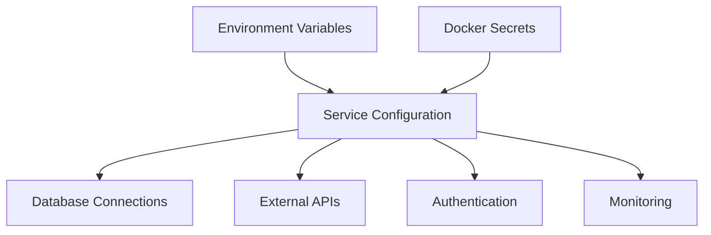

# Secrets Management in NexaNest

This document describes the comprehensive secrets management strategy implemented in NexaNest, covering environment variables, Docker secrets, and security best practices.

## ✅ Implementation Status

**Issue #12 - Configure environment variables and secrets management** has been fully implemented with:

- ✅ Environment variable templates created
- ✅ Docker secrets configuration implemented  
- ✅ Service-specific environment files configured
- ✅ Docker Compose files updated with secrets management
- ✅ Service code updated to support Docker secrets
- ✅ Automated setup scripts created
- ✅ Comprehensive documentation provided

## Overview

NexaNest implements a multi-layered approach to secrets management that supports both development and production environments:

- **Development**: Environment variables in `.env` files
- **Production**: Docker secrets with fallback to environment variables
- **Service isolation**: Service-specific configuration files
- **Security**: No secrets committed to version control

## Architecture



## Quick Start

### 1. Initial Setup

Run the setup script to generate all necessary configuration files:

```bash
./scripts/setup-secrets.sh
```

This script will:
- Create `.env` and `.env.db` files with generated passwords
- Set up Docker secrets directory and generate secure secrets
- Create service-specific environment files
- Update `.gitignore` to protect sensitive files

### 2. Development Environment

For local development, use environment variables:

```bash
# Start databases
docker-compose -f infrastructure/docker/docker-compose.db.yml up -d

# Start services with environment variables
cd services/auth && python -m app.main
```

### 3. Production Deployment

For production, use Docker secrets:

```bash
# Deploy with secrets
docker-compose -f infrastructure/docker/docker-compose.yml \
               -f infrastructure/docker/docker-compose.secrets.yml up -d
```

## Configuration Files

### Root Environment Files

#### `.env.example`
Template file with all available configuration options. Copy this to `.env` for development.

```env
# Database Configuration
POSTGRES_PASSWORD=your_secure_postgres_password_here
TIMESCALE_PASSWORD=your_secure_timescale_password_here
REDIS_PASSWORD=your_secure_redis_password_here

# Security
JWT_SECRET_KEY=your_jwt_secret_key_minimum_32_characters_long
SECRET_KEY=your_very_secure_secret_key_minimum_32_characters_long

# External APIs
OPENAI_API_KEY=your_openai_api_key
GOOGLE_CLIENT_SECRET=your_google_client_secret
```

#### `.env.db.example`
Database-specific configuration template with connection URLs and credentials.

### Service-Specific Files

Each service has its own `.env.example` file in `services/{service}/.env.example`:

- `services/auth/.env.example` - Authentication service configuration
- `services/portfolio/.env.example` - Portfolio service configuration
- `services/market-data/.env.example` - Market data service configuration

## Docker Secrets

### Secrets Directory Structure

```
infrastructure/secrets/
├── generate-secrets.sh          # Script to generate all secrets
└── secrets/                     # Generated secrets (not in git)
    ├── postgres_password
    ├── jwt_secret_key
    ├── openai_api_key
    └── ...
```

### Supported Secrets

| Secret Name | Usage | Generated |
|-------------|-------|-----------|
| `postgres_password` | PostgreSQL database | ✅ |
| `timescale_password` | TimescaleDB database | ✅ |
| `redis_password` | Redis cache | ✅ |
| `jwt_secret_key` | JWT token signing | ✅ |
| `secret_key` | Application secret | ✅ |
| `auth_secret_key` | Auth service secret | ✅ |
| `openai_api_key` | OpenAI API | ❌ Manual |
| `google_client_secret` | Google OAuth | ❌ Manual |

### Creating Secrets

#### Automatic Generation

```bash
# Generate all secrets automatically
./infrastructure/secrets/generate-secrets.sh
```

#### Manual API Keys

Fill in API keys manually in the generated secret files:

```bash
# Add your OpenAI API key
echo "sk-your-openai-key-here" > infrastructure/secrets/secrets/openai_api_key

# Add Google OAuth secret
echo "your-google-client-secret" > infrastructure/secrets/secrets/google_client_secret
```

## Service Configuration

### Environment Variable Priority

Services load configuration in this order (highest priority first):

1. **Docker secrets** (production): `/run/secrets/{secret_name}`
2. **Environment files**: Service-specific `.env` files
3. **Default values**: Hardcoded defaults in configuration

### Configuration Pattern

Each service implements the same pattern for secrets handling:

```python
from pathlib import Path
from typing import Optional

def read_secret_file(file_path: Optional[str]) -> Optional[str]:
    """Read secret from Docker secrets file if it exists."""
    if not file_path:
        return None
    
    try:
        secret_path = Path(file_path)
        if secret_path.exists():
            return secret_path.read_text().strip()
    except Exception:
        pass
    return None

class Settings(BaseSettings):
    # Environment variable
    POSTGRES_PASSWORD: str = "default_password"
    # Docker secrets file path
    POSTGRES_PASSWORD_FILE: Optional[str] = None
    
    def get_postgres_password(self) -> str:
        """Get password from file or environment variable."""
        password_from_file = read_secret_file(self.POSTGRES_PASSWORD_FILE)
        return password_from_file or self.POSTGRES_PASSWORD
```

## Security Best Practices

### Development

1. **Never commit secrets**: All sensitive files are in `.gitignore`
2. **Use strong passwords**: Generated passwords are 32+ characters
3. **Rotate regularly**: Regenerate development secrets monthly
4. **Isolate services**: Each service has its own configuration

### Production

1. **Use Docker secrets**: Never use environment variables for production secrets
2. **Secure secret storage**: Store secrets in encrypted volumes
3. **Access control**: Limit secret access to necessary services only
4. **Audit trail**: Log secret access and rotation events
5. **Backup strategy**: Securely backup secrets with encryption

### API Keys

1. **Separate accounts**: Use different API accounts for dev/staging/production
2. **Minimum permissions**: Grant only necessary API permissions
3. **Rate limiting**: Configure appropriate rate limits
4. **Monitoring**: Monitor API usage and quota consumption

## Environment-Specific Configuration

### Development

```yaml
# docker-compose.override.yml
version: '3.9'
services:
  auth:
    environment:
      DEBUG: "true"
      LOG_LEVEL: DEBUG
    env_file:
      - .env
      - services/auth/.env
```

### Production

```yaml
# docker-compose.prod.yml
version: '3.9'
services:
  auth:
    environment:
      DEBUG: "false"
      LOG_LEVEL: INFO
    secrets:
      - secret_key
      - postgres_password
      - jwt_secret_key
```

## Troubleshooting

### Common Issues

#### Secret Files Not Found

```bash
# Check if secrets directory exists
ls -la infrastructure/secrets/secrets/

# Regenerate secrets if missing
./infrastructure/secrets/generate-secrets.sh
```

#### Environment Variables Not Loading

```bash
# Check .env file exists
ls -la .env services/*/(.env)

# Verify file permissions
chmod 600 .env services/*/.env
```

#### Database Connection Failures

```bash
# Check database passwords match
grep POSTGRES_PASSWORD .env .env.db

# Verify database is running
docker-compose -f infrastructure/docker/docker-compose.db.yml ps
```

### Debug Mode

Enable debug logging to troubleshoot configuration issues:

```env
DEBUG=true
LOG_LEVEL=DEBUG
```

## Scripts and Automation

### Setup Scripts

| Script | Purpose |
|--------|---------|
| `scripts/setup-secrets.sh` | Complete environment setup |
| `infrastructure/secrets/generate-secrets.sh` | Generate Docker secrets |

### Docker Compose Commands

```bash
# Development with environment variables
docker-compose -f infrastructure/docker/docker-compose.db.yml up -d

# Production with secrets
docker-compose -f infrastructure/docker/docker-compose.yml \
               -f infrastructure/docker/docker-compose.secrets.yml up -d

# View services
docker-compose ps

# View logs
docker-compose logs -f auth
```

## Migration Guide

### From Environment Variables to Docker Secrets

1. **Generate secrets**:
   ```bash
   ./infrastructure/secrets/generate-secrets.sh
   ```

2. **Update service configuration**:
   Add `*_FILE` environment variables pointing to secret files.

3. **Deploy with secrets**:
   ```bash
   docker-compose -f docker-compose.yml -f docker-compose.secrets.yml up -d
   ```

4. **Verify secrets are loaded**:
   ```bash
   docker exec -it service_name env | grep -v PASSWORD
   ```

## Compliance and Auditing

### SOC 2 Requirements

- ✅ Encryption at rest (Docker secrets)
- ✅ Access controls (file permissions)
- ✅ Audit logging (service configuration)
- ✅ Secret rotation (automated scripts)
- ✅ Separation of duties (dev/prod isolation)

### Audit Checklist

- [ ] No secrets in git history
- [ ] All production services use Docker secrets
- [ ] Secret files have correct permissions (600/700)
- [ ] API keys have minimum required permissions
- [ ] Regular secret rotation schedule established
- [ ] Backup and recovery procedures tested

## Next Steps

1. **Set up secret rotation**: Implement automated secret rotation
2. **External secret management**: Consider HashiCorp Vault or AWS Secrets Manager
3. **Certificate management**: Add TLS certificate automation
4. **Monitoring**: Set up alerts for secret access and rotation events

---

**Security Note**: This document describes the configuration management system. Never include actual secrets or passwords in documentation.